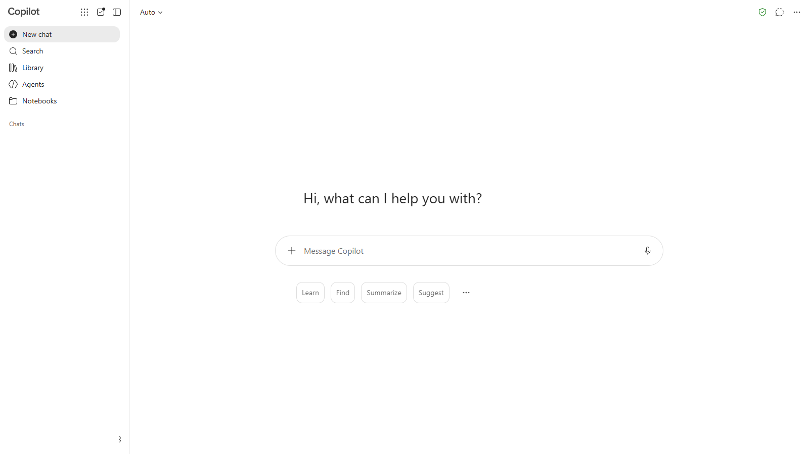
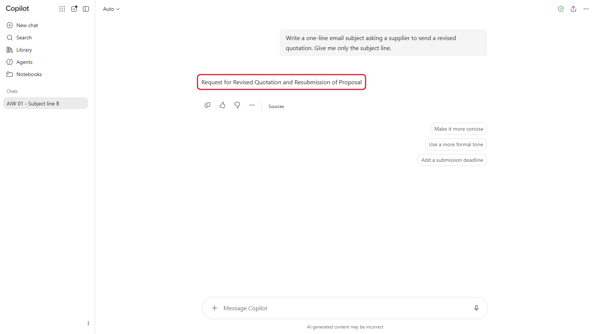
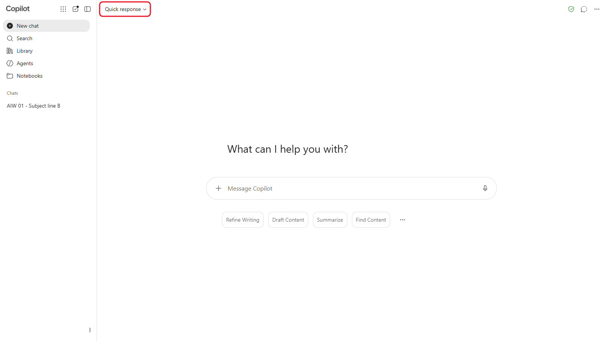
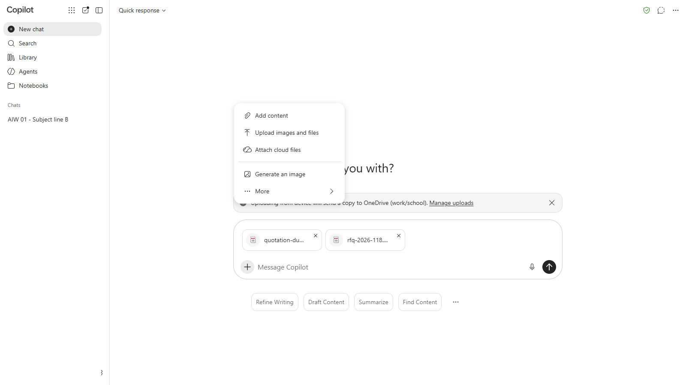
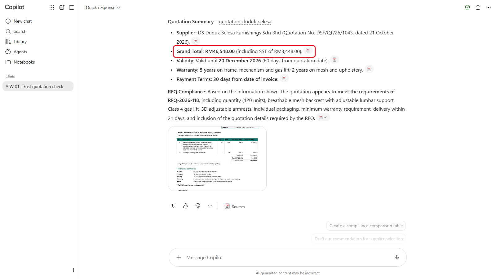
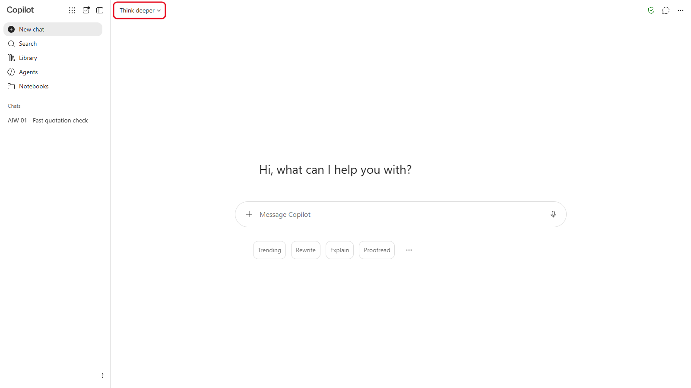
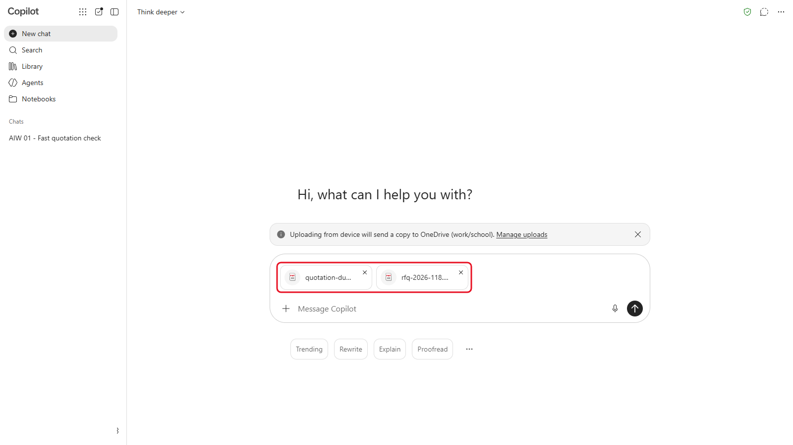
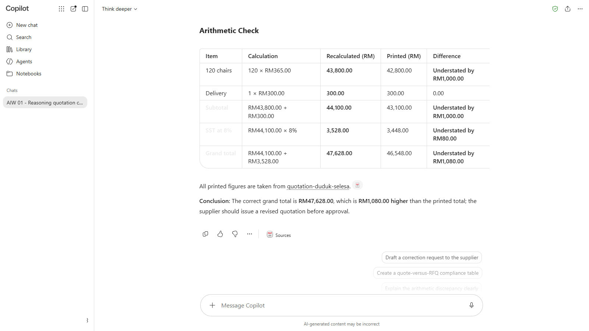

# 01 - How Large Language Models Really Behave

Before you build anything, it helps to know what's going on inside the tool. An AI assistant doesn't look answers up or calculate them the way a spreadsheet does. It predicts text. That explains most of what it does well, and most of what it gets wrong. In this module you give the same supplier quotation to two kinds of model and compare what they notice.

> **Prompts:** every prompt you need is in the steps, with a Copy button. The [prompts page](./prompts.md) has them all on one page too.

**Day:** 1

**Estimated time:** 40 minutes

**Your result:** Two analyses of the same quotation, one from a fast model and one from a reasoning model, and a short note on how they differ.

---

## What You Will Learn

- Explain in plain words how a large language model produces an answer
- Say why the same prompt can give a different answer each time
- Tell a fast model from a reasoning model, and when to use each
- Name the kinds of mistake to check for: arithmetic, dates and made-up details

---

## Before You Begin

You need one AI tool open and signed in (see the [product cards](../14-product-cards/)), and the sample files:

| File | What it is |
|---|---|
| `rfq-2026-118.pdf` | Sinar Maju's request for quotation for 120 ergonomic mesh chairs |
| `quotation-duduk-selesa.pdf` | One supplier's reply to that request |

Download both at once with **[sample-files.zip](./sample-files.zip)**, then right-click the ZIP and choose **Extract All**.

> **Note:** every company, person and figure in the course files is fictional. Sinar Maju Sdn Bhd is an office supplies distributor in Petaling Jaya, and in this course you work in its Procurement Department.

---

## Topics

**Prediction, not lookup.** A large language model (LLM) writes one small piece of text at a time, each time picking a likely next piece based on everything before it. It has no calculator and no database unless the tool gives it one. A total printed in a quotation is just more text to it.

**Why answers vary.** The model chooses among likely next words with a little randomness, so the same prompt can give a different answer each time. That's useful for drafting, and a reason to check anything that must be exact.

**Fast and reasoning models.** A fast model answers straight away. A reasoning (or "thinking") model works through the problem in steps before it answers, which takes longer but catches more in tasks like checking figures. Most tools let you choose.

**What to check.** LLMs are strong at reading, summarising and rewriting. They're weaker at arithmetic, dates, and saying "I don't know". They can also state a detail confidently that isn't in the source. Every module in this course builds a habit of checking for these.

---

## 1.1 Ask the Same Question Twice

1. Open your AI tool and start a new chat.

   <!-- Screenshot still to capture: 01-01-open-ai-tool-start.png. Remove this comment wrapper when the image is added.
   

   *Caption to write after capture.*
   -->
2. Send this prompt:

   ```
   Write a one-line email subject asking a supplier to send a revised quotation. Give me only the subject line.
   ```

   <!-- Screenshot still to capture: 01-02-send-prompt.png. Remove this comment wrapper when the image is added.
   

   *Caption to write after capture.*
   -->

3. Start another new chat and send exactly the same prompt.

   <!-- Screenshot still to capture: 01-03-start-another-new-chat.png. Remove this comment wrapper when the image is added.
   

   *Caption to write after capture.*
   -->
4. Compare the two subject lines.

The wording is almost certainly different. Neither is wrong: the model picked different likely words. Keep that in mind when you need an exact figure.

---

## 1.2 Check the Quotation with a Fast Model

1. Start a new chat and choose a fast model (the [product cards](../14-product-cards/) show where).

   <!-- Screenshot still to capture: 01-04-start-new-chat-choose.png. Remove this comment wrapper when the image is added.
   

   *Caption to write after capture.*
   -->
2. Upload `rfq-2026-118.pdf` and `quotation-duduk-selesa.pdf`.

   <!-- Screenshot still to capture: 01-05-upload-rfq-2026-118.png. Remove this comment wrapper when the image is added.
   

   *Caption to write after capture.*
   -->
3. Send this prompt:

   ```
   I work in procurement at Sinar Maju Sdn Bhd. I've uploaded our request for quotation (RFQ-2026-118) and one supplier's quotation. Summarise the quotation in five bullets: supplier, grand total, validity, warranty and payment terms. Then tell me in one sentence whether it meets the RFQ.
   ```

   <!-- Screenshot still to capture: 01-06-send-prompt.png. Remove this comment wrapper when the image is added.
   

   *Caption to write after capture.*
   -->

4. Write down the grand total the model gives you, and whether it says the quotation meets the RFQ.

---

## 1.3 Check It Again with a Reasoning Model

1. Start a new chat and switch to a reasoning (thinking) model.

   <!-- Screenshot still to capture: 01-07-start-new-chat-switch.png. Remove this comment wrapper when the image is added.
   

   *Caption to write after capture.*
   -->
2. Upload the same two files.

   <!-- Screenshot still to capture: 01-08-upload-same-two-files.png. Remove this comment wrapper when the image is added.
   

   *Caption to write after capture.*
   -->
3. Send the same prompt as in 1.2, then send this one:

   ```
   Now check the arithmetic. Recalculate every line amount as quantity x unit price, then the subtotal, the tax and the grand total. Show your working in a table and compare each figure with the one printed in the quotation.
   ```

   <!-- Screenshot still to capture: 01-09-send-same-prompt-1.png. Remove this comment wrapper when the image is added.
   

   *Caption to write after capture.*
   -->

4. Compare what the reasoning model found with your notes from 1.2.

> **Tip:** don't take either model's word for a figure. Check one line yourself with a calculator: quantity times unit price.

<details markdown="1">
<summary>What should you see?</summary>

The quotation prints a grand total of **RM46,548.00**, but it should be **RM47,628.00**.

Line 1 is 120 chairs at RM365.00, which is RM43,800.00. The quotation prints RM42,800.00, and the subtotal, tax and grand total all carry that RM1,000.00 gap. The amount in words matches the wrong figure, so the page looks consistent.

A fast model often repeats the printed total without checking it. A reasoning model is more likely to work out 120 x 365.00 and find the gap. Either can miss it, which is what you'll discuss.

</details>

---

## 1.4 Discuss What You Saw

With the person next to you, answer these three questions:

1. Did the fast model check the figures, or repeat the ones printed on the page?
2. What did the reasoning model do differently, and how much longer did it take?
3. For which tasks in your own work would you choose each kind of model?

> **Key point:** a confident, well-formatted answer isn't a checked answer. You'll build the checking into an assistant of your own in Module 03.

---

## Product Notes

| Copilot Chat (Basic) | M365 Copilot (Premium) | ChatGPT | Claude | Gemini |
|---|---|---|---|---|
| Choose a quick or deeper reasoning option in the model menu at the top of the chat (it shows **Auto** by default). At most three files per message | Same as Basic | Choose a fast or thinking model in the model menu. Free may only offer one model | Choose a model, or turn extended thinking on, in the model menu under the message box | Choose a fast or thinking model in the model menu |

<!-- VERIFY: model menu option names in each tool, October 2026 (see the VERIFY notes in the product cards). -->

---

## Independent Practice

Give a fast model a question you already know the answer to from your own work, such as a calculation or a date difference. Then ask a reasoning model. Did either get it wrong? Which one told you how it got the answer?

---

## Troubleshooting

| Symptom | What to check |
|---|---|
| You can't find a model menu | Some free plans offer one model only. Pair up with someone on another tool or plan |
| The model says it can't read the PDF | Upload it again. If it still fails, open the PDF, copy all the text and paste it into the chat |
| Both models give the same answer | Good. Check one line with a calculator anyway: the point is to check, not to trust the slower model |
| The answer stops halfway | The tool is busy. Wait a minute and send the prompt again |

---

## Lesson Summary

An LLM predicts text, so it's very good with words and less reliable with sums, dates and exact facts. Reasoning models work through problems step by step and catch more, but they can still miss things. From here on, every lab includes a check you do yourself.

**Check yourself:** Why might a fast model repeat a wrong total printed in a quotation without noticing?
