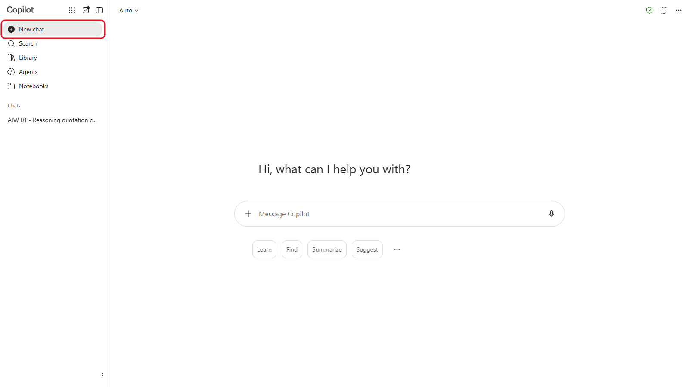
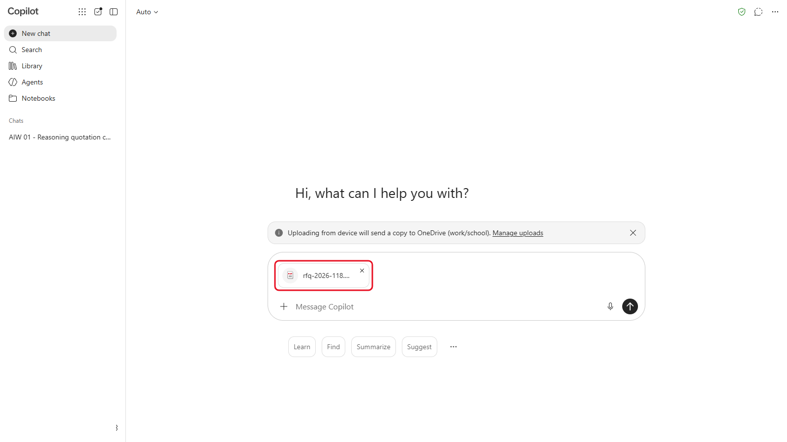
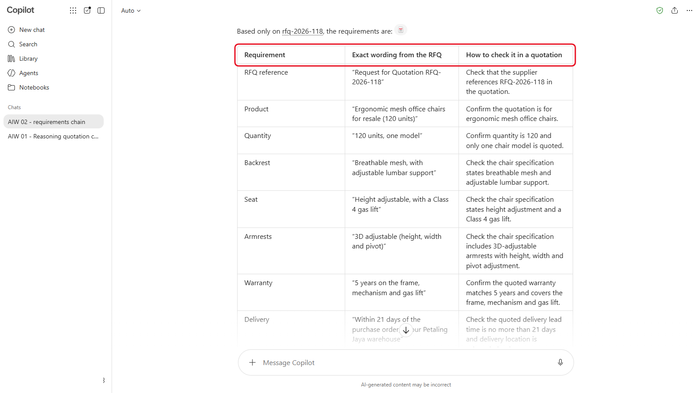
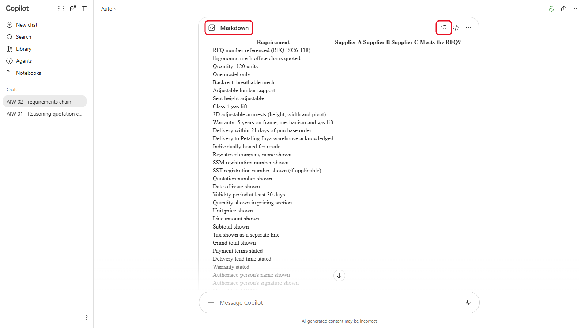
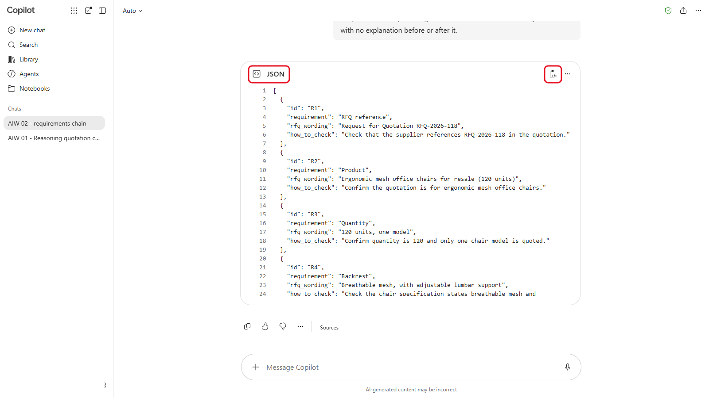
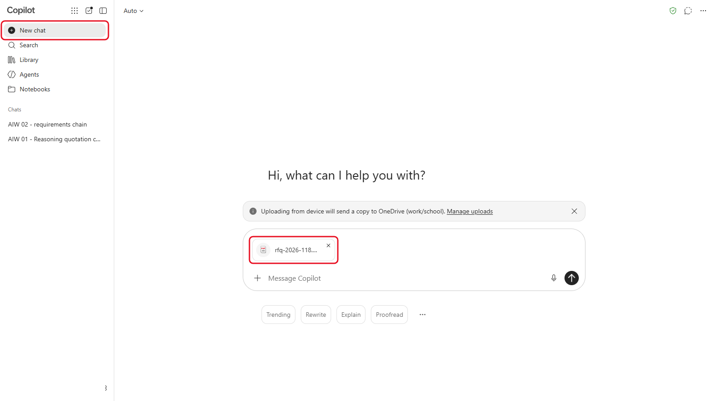
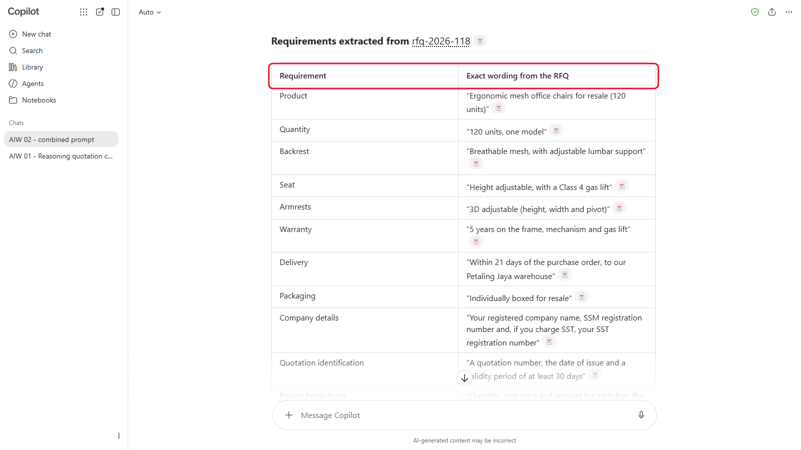

# 02 - Context Engineering and Structured Output

In Module 01 you saw that a model only knows what's in front of it. Context engineering is the skill of putting the right things in front of it: the task, the background, the source, the format, and nothing that gets in the way. In this module you break one job into a chain of three short prompts, and get the output in formats a person and a machine can both use.

> **Prompts:** every prompt you need is in the steps, with a Copy button. The [prompts page](./prompts.md) has them all on one page too.

**Day:** 1

**Estimated time:** 50 minutes

**Your result:** A requirements checklist, a blank comparison table and a JSON version of the same requirements, all from Sinar Maju's chair RFQ.

---

## What You Will Learn

- List what goes into a model's context: instructions, files, chat history and memory
- Write a prompt with GCSE (Goal, Context, Source, Expectations) and clear boundaries around the source
- Break a job into a chain of short prompts, each building on the last
- Ask for structured output: Markdown tables for people, JSON for other systems
- Know when to start a new chat

---

## Before You Begin

You need `rfq-2026-118.pdf` from Module 01. If you don't have it, download **[Module 01's sample-files.zip](../01-how-llms-behave/sample-files.zip)** and extract it.

---

## Topics

**Context is everything the model sees.** That's your prompt, any files, the earlier messages in the chat, your custom instructions and anything the tool remembers about you. The model can't tell which parts matter most unless you say so. A long chat full of earlier tasks can confuse it, which is why a fresh chat often gives a better answer.

**GCSE, one level up.** From the Beginner course: **G**oal (what you want), **C**ontext (who it's for and why), **S**ource (what to use) and **E**xpectations (format, length, tone). At this level, add boundaries: tell the model to use only the source, and say what to do when the source doesn't answer the question.

**Prompt chains.** One huge prompt asks the model to do everything at once, and mistakes are hard to spot. A chain does one step per prompt. You check each result before the next step uses it.

**Structured output.** A Markdown table is easy for people to read and paste into Word or Excel. JSON is a format other software can read, field by field. On Day 2 your n8n workflow will need JSON.

---

## 2.1 Step 1: Extract the Requirements

1. Start a new chat in your AI tool.

   

   *Start from an empty chat so nothing from earlier work gets in.*
2. Upload `rfq-2026-118.pdf`.

   

   *The RFQ attached and ready to send with the prompt.*
3. Send this prompt:

   ```
   Goal: list every requirement in the attached request for quotation (RFQ-2026-118) so I can check supplier quotations against it.
   Context: I'm a procurement executive at Sinar Maju Sdn Bhd, an office supplies distributor. We'll receive several quotations for this RFQ.
   Source: use only the attached RFQ. If something isn't stated in it, don't add it.
   Expectations: a Markdown table with three columns: Requirement, Exact wording from the RFQ, How to check it in a quotation. Include the requirements for what a quotation must contain, not only the product.
   ```

   

   *Step 1's table. Check every quote in the middle column against the RFQ.*

4. Check the table against the RFQ. Every row should come from the document, word for word in the second column.

> **Tip:** if a row isn't in the RFQ, reply `Remove any row you can't quote from the RFQ.` That's the boundary in the Source line doing its job.

---

## 2.2 Step 2: Turn It into a Comparison Table

In the same chat, send:

```
Using only the requirements table above, make a blank comparison table in Markdown for three supplier quotations. One row per requirement. Columns: Requirement, Supplier A, Supplier B, Supplier C, Meets the RFQ? Leave the supplier cells empty. Add rows at the bottom for Grand total (RM), Valid until and Payment terms.
```



*Copilot puts the table in a **Markdown** box. Use its copy button to paste it into Word or Excel.*

Some tools split a combined requirement into several rows, for example "Breathable mesh, with adjustable lumbar support" into two. That's fine, as long as every row still comes from your Step 1 table.

Copy the table into Word or Excel to see that it pastes cleanly. You'll fill a table like this with real quotations in Module 03.

---

## 2.3 Step 3: Turn It into JSON

In the same chat, send:

```
Now give me the same requirements as JSON, so another system can read them. Use a list of objects, each with these fields: "id" (R1, R2 and so on), "requirement", "rfq_wording" and "how_to_check". Return only the JSON, with no explanation before or after it.
```



*Step 3's JSON: one object per requirement, with the four fields you asked for.*

Check that each object matches a row of your Step 1 table. On Day 2, your n8n workflow will ask the AI for a JSON answer in the same way.

> **Note:** the exact JSON will differ from one person to the next, as you saw in Module 01. What should match is the content: the same requirements, in fields with the names you asked for.

---

## 2.4 Compare with One Big Prompt

1. Start a **new chat** and upload `rfq-2026-118.pdf` again.

   

   *A fresh chat for the one big prompt, so it can't build on the chain.*
2. Send everything at once:

   ```
   Read the attached RFQ, list all the requirements, make a blank comparison table for three suppliers, and give me the requirements as JSON.
   ```

   

   *The one big prompt. Compare its columns and rows with your chain.*

3. Compare the result with your three-step chain. Which one missed a requirement, or mixed the formats up? Which would you trust to build on?

---

## Product Notes

| Copilot Chat (Basic) | M365 Copilot (Premium) | ChatGPT | Claude | Gemini |
|---|---|---|---|---|
| Upload the RFQ with **+**. Copilot may show a table or JSON in a **Markdown** or **JSON** box: copy it with the box's own copy button | Same as Basic | Tables and JSON show in formatted boxes with a copy button | Long JSON may open in a side panel; copy from there | Use **Export to Sheets** under a table to send it to Google Sheets |

<!-- VERIFY: Gemini's Export to Sheets option and Claude's side panel for long code, October 2026. The Module 02 capture used Copilot only, so neither was checked. -->

---

## Independent Practice

Take a form or checklist from your own work (with no real data in it). Ask your AI tool to turn it into JSON with field names you choose. Then ask it to turn the JSON back into a Markdown table. Did anything get lost?

---

## Troubleshooting

| Symptom | What to check |
|---|---|
| The table has requirements that aren't in the RFQ | Ask it to quote the RFQ wording for each row, and remove rows it can't quote |
| The model forgot the earlier table | You started a new chat. Steps 1 to 3 must be in the same chat |
| The JSON has text before or after it | Ask again: "Return only the JSON." |
| The JSON field names are different from the ones you asked for | Paste the field names again and ask it to use exactly those |

---

## Lesson Summary

Good context is specific and bounded: the goal, the background, the one source to use, and the format you need. Short chained prompts let you check each step before the next one depends on it. And the format is part of the request: a table for people, JSON for software.

**Check yourself:** Why is it safer to run three short prompts in one chat than one long prompt, and when should you start a new chat instead?
