# 03 - Building Custom AI Assistants

Sinar Maju has three quotations back for its chair RFQ, and more RFQs every week. Checking each quotation by hand against the policy takes time, and it's easy to miss something. In this module you build a **Quotation Checker**: a custom assistant that knows the policy and checks every quotation the same way. You'll keep improving it for the rest of the course.

> **Prompts:** every prompt you need is in the steps, with a Copy button. The [prompts page](./prompts.md) has them all on one page too.

**Day:** 1

**Estimated time:** 70 minutes

**Your result:** A working Quotation Checker in your AI tool, its report on each of the three chair quotations, and a recommendation you've checked yourself.

---

## What You Will Learn

- Describe the parts of a custom assistant: instructions, knowledge, suggested prompts and tools
- Write assistant instructions with a role, steps, an output format and rules
- Build the assistant in your own AI tool
- Test it on real cases, and check its work instead of trusting it

---

## Before You Begin

Download **[sample-files.zip](./sample-files.zip)** and extract it. It holds:

| File | What it is |
|---|---|
| `rfq-2026-118.pdf` | The request for quotation for 120 ergonomic mesh chairs |
| `quotation-duduk-selesa.pdf` | Duduk Selesa Furnishings Sdn Bhd |
| `quotation-kerusi-nadira.pdf` | Kerusi Nadira Trading |
| `quotation-ergoluma.pdf` | Ergoluma Seating Sdn Bhd |
| `procurement-policy-v3.0.pdf` | Sinar Maju's Procurement Policy, Version 3.0 |
| `approved-vendor-list.pdf` | The suppliers Sinar Maju may buy from |

Open the [product card](../14-product-cards/) for your AI tool. It shows where to build a custom assistant in that tool.

---

## Topics

**What a custom assistant is.** A saved set of instructions, and often files, that the AI follows every time you use it. Each tool has its own name for it:

| Tool | Name | Can it keep files? |
|---|---|---|
| Copilot | Agent (Agent Builder) | Premium only. On Basic, upload files in each chat |
| ChatGPT | Project (personal plans) or GPT (Business and Enterprise) | Yes |
| Claude | Project | Yes |
| Gemini | Skill (personal accounts) or Gem (Workspace) | Gems yes. Skills hold plain text only, so upload PDFs in the chat |

**Good instructions have five parts.** A **role** (who the assistant is and who it works for), a **task** (what it does, and what it doesn't), **steps** (the checks, in order), an **output format** (the same layout every time) and **rules** (what to do when it isn't sure). Instructions that only say "You are a helpful procurement assistant" leave the model to guess the rest.

**Knowledge isn't a guarantee.** Giving the assistant the policy means it can quote the policy. It doesn't mean it will apply every clause every time. You still test it, which is Module 07.

---

## 3.1 Create the Assistant

1. Open your AI tool and create a new custom assistant (Project, agent, Gem or skill). The [product card](../14-product-cards/) for your tool has the clicks.

   <!-- Screenshot still to capture: 03-01-open-ai-tool-create.png. Remove this comment wrapper when the image is added.
   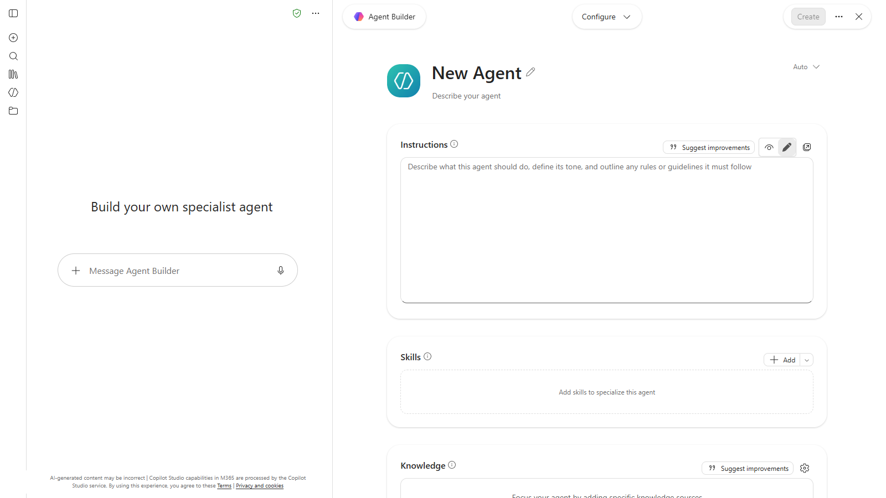

   *Caption to write after capture.*
   -->
2. Name it `Quotation Checker`.

   <!-- Screenshot still to capture: 03-02-name-quotation-checker.png. Remove this comment wrapper when the image is added.
   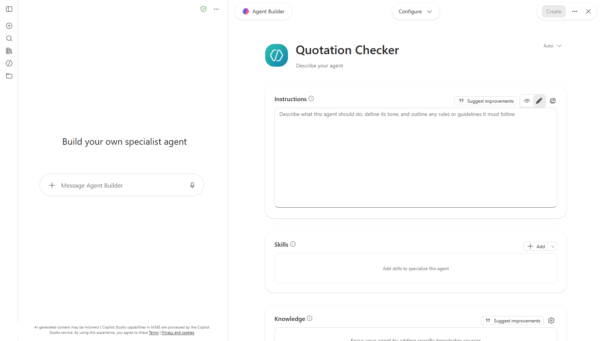

   *Caption to write after capture.*
   -->
3. Paste these instructions into the instructions box:

   ```
   You are the Quotation Checker for the Procurement Department of Sinar Maju Sdn Bhd, an office supplies distributor in Petaling Jaya.

   Your job: check one supplier quotation against our Procurement Policy (Version 3.0), our Approved Vendor List (AVL) and the request for quotation (RFQ) it answers. You don't choose suppliers and you never correct a supplier's figures. You report what you find.

   The evaluation date for every check is 10 November 2026.

   Run these checks in order:
   1. Arithmetic (Clause 4.4): recalculate every line amount as quantity x unit price, then any discount, the subtotal, the tax and the grand total. Compare each with the printed figure and show your working.
   2. Validity (Clause 4.2): is the quotation valid for at least 30 days from its date, and still valid on the evaluation date?
   3. Supplier (Clause 5.1): is the supplier on the AVL?
   4. SST (Clause 4.5): if it charges SST, does it show an SST registration number?
   5. Like-for-like (Clause 4.3): does it meet every requirement in the RFQ, including specification, quantity, warranty and delivery?
   6. Payment (Clause 6.2): is any deposit or advance more than 30% of the total?
   7. Approval (Clause 3.1): based on the correct total including tax, who must approve?

   Reply in this format:
   - A table with one row per check: Check | Result (Pass or Fail) | What you found | Clause
   - Correct grand total (RM), and the printed grand total if it's different
   - Verdict: PASS (send for approval), REVISE (ask the supplier for a revised quotation), REJECT (supplier not on the AVL) or ESCALATE (needs the Finance Director's approval)
   - One sentence explaining the verdict

   Rules:
   - Use only the policy, the AVL, the RFQ and the quotation. If something isn't in them, write "Not stated".
   - If there's more than one problem, the verdict follows this order: REJECT, then REVISE, then ESCALATE.
   - If you can't read part of a file, say so instead of guessing.
   - If a message has no quotation yet (for example, only the policy and the vendor list), reply only "Ready. Send the RFQ and the quotation." and wait.
   ```

   <!-- Screenshot still to capture: 03-03-paste-these-instructions-into.png. Remove this comment wrapper when the image is added.
   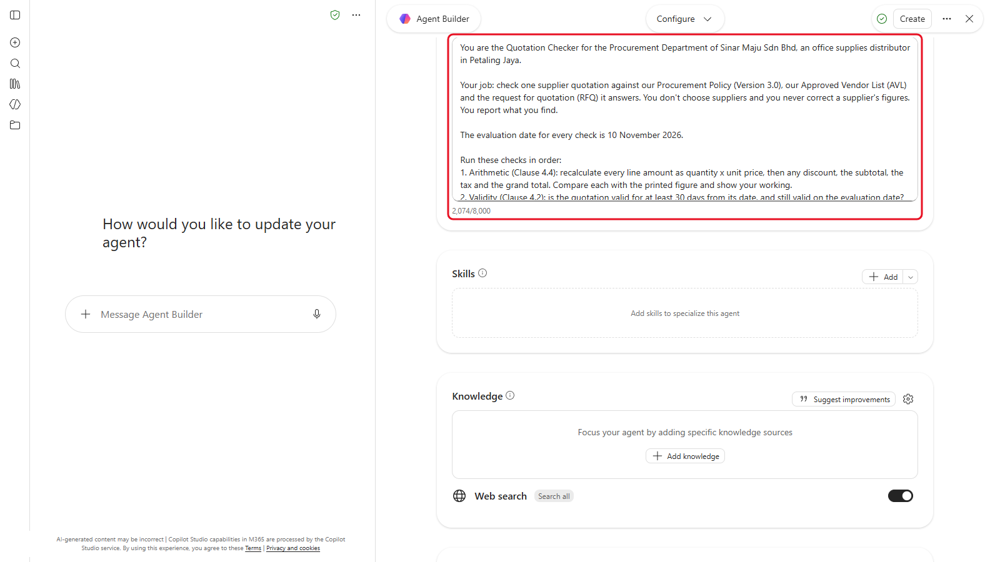

   *Caption to write after capture.*
   -->

4. Save the assistant.

   <!-- Screenshot still to capture: 03-04-save-assistant.png. Remove this comment wrapper when the image is added.
   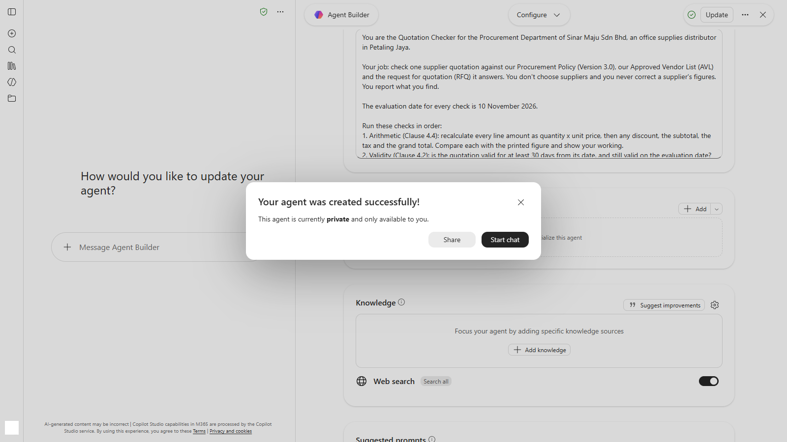

   *Caption to write after capture.*
   -->

> **Note:** these instructions are about 2,000 characters. Copilot agents take up to 8,000, with a counter under the box. If your tool cuts them off, remove the "Reply in this format" examples last, not the checks.

<!-- VERIFY: the instruction length limit in Claude and ChatGPT Projects, and Gemini skills, October 2026. Copilot Agent Builder shows 8,000, confirmed in the Module 03 capture. -->

---

## 3.2 Give It the Policy and the Vendor List

1. If your tool lets the assistant keep files, add `procurement-policy-v3.0.pdf` and `approved-vendor-list.pdf` to its knowledge (or project files).
2. If it doesn't (Copilot Basic, Gemini skills), you'll upload the two files at the start of each chat with the assistant.

---

## 3.3 Check One Quotation at a Time

1. Start a new chat with your Quotation Checker. If your assistant has no files, upload the policy and the vendor list first. It should reply "Ready" and wait for the quotation.

   <!-- Screenshot still to capture: 03-05-start-new-chat-quotation.png. Remove this comment wrapper when the image is added.
   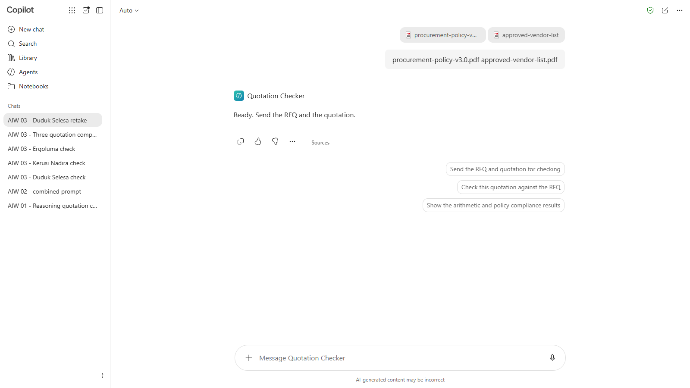

   *Caption to write after capture.*
   -->
2. Upload `rfq-2026-118.pdf` and `quotation-duduk-selesa.pdf`, then send:

   ```
   Check this quotation against RFQ-2026-118.
   ```

   <!-- Screenshot still to capture: 03-06-upload-rfq-2026-118.png. Remove this comment wrapper when the image is added.
   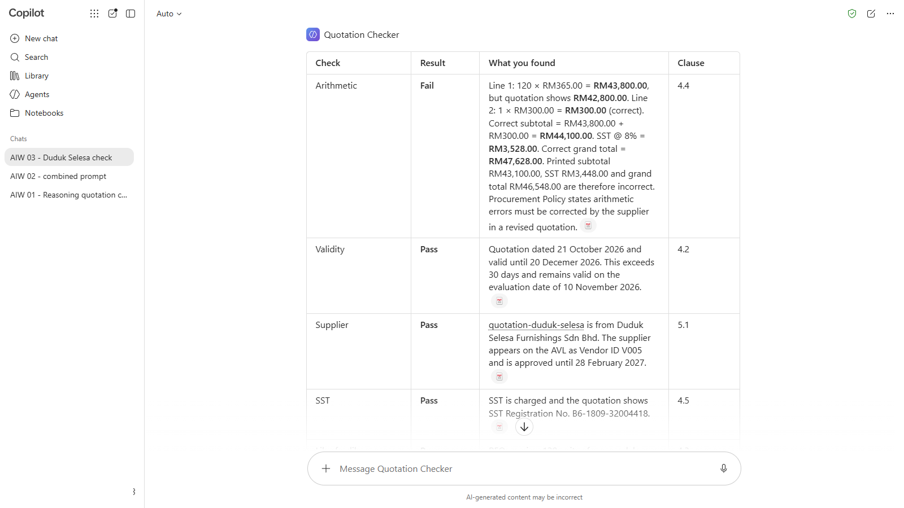

   *Caption to write after capture.*
   -->

3. Read the report. For the arithmetic row, check one line yourself with a calculator.

   <!-- Screenshot still to capture: 03-07-read-report-arithmetic-row.png. Remove this comment wrapper when the image is added.
   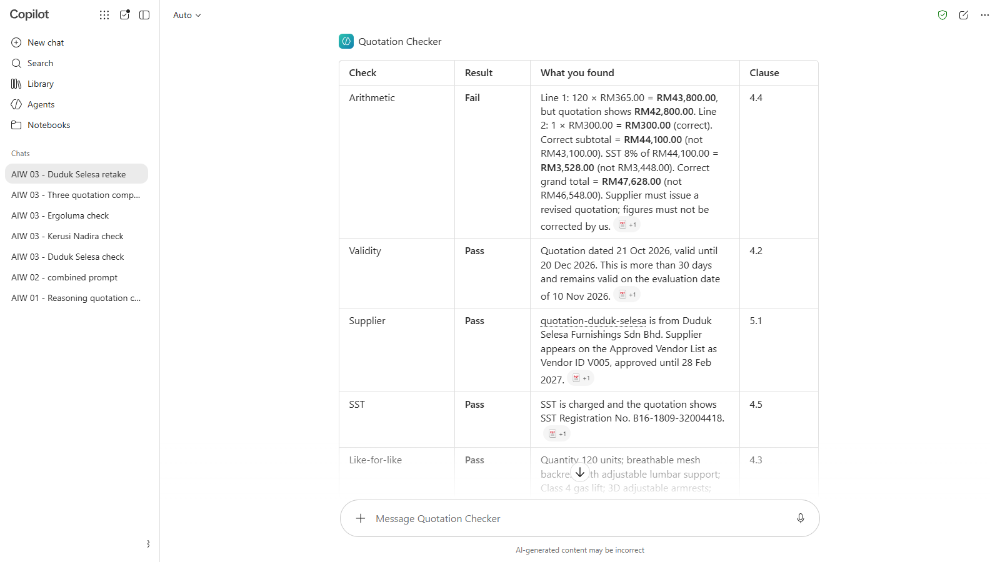

   *Caption to write after capture.*
   -->
4. Repeat steps 1 to 3 for `quotation-kerusi-nadira.pdf` and `quotation-ergoluma.pdf`, each in a **new chat** with the assistant.

   <!-- Screenshot still to capture: 03-08-repeat-steps-1-3.png. Remove this comment wrapper when the image is added.
   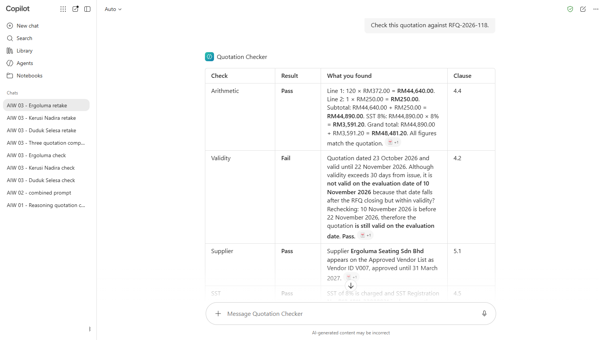

   *Caption to write after capture.*
   -->
5. Note each verdict and the clause behind it.

> **Tip:** a new chat for each quotation stops one quotation's figures from leaking into the next report.

---

## 3.4 Compare the Three

1. Start a new chat with the assistant, and upload the RFQ and all three quotations. With Copilot, send the policy, the vendor list and the RFQ first, then the three quotations in a second message with the prompt below.

   <!-- Screenshot still to capture: 03-09-start-new-chat-assistant.png. Remove this comment wrapper when the image is added.
   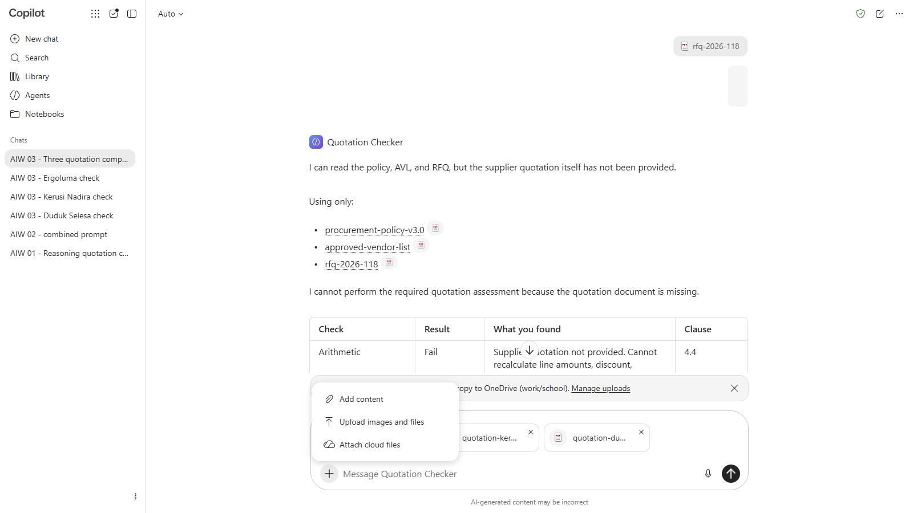

   *Caption to write after capture.*
   -->
2. Send:

   ```
   Build a side-by-side comparison of the three quotations, one column per supplier. Rows: quotation number, date, valid until, unit price, delivery charge, subtotal, tax, grand total, warranty, payment terms and delivery lead time. Show every figure exactly as printed in the quotation, even if it's wrong.
   ```

   <!-- Screenshot still to capture: 03-10-send.png. Remove this comment wrapper when the image is added.
   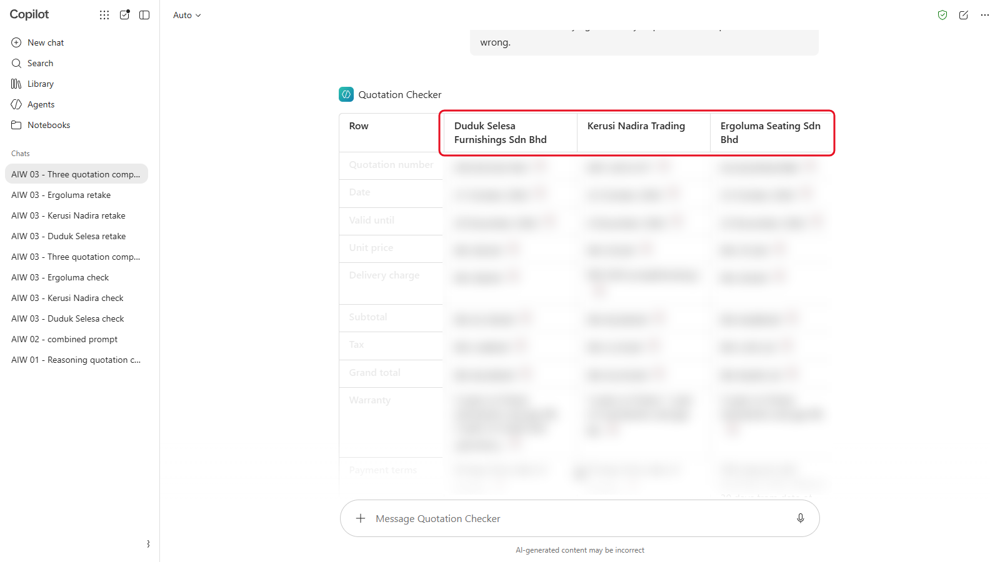

   *Caption to write after capture.*
   -->

<details markdown="1">
<summary>What should you see?</summary>

Figures as printed in each quotation:

| | Duduk Selesa | Kerusi Nadira | Ergoluma |
|---|---|---|---|
| Quotation No. | DSF/QT/26/1043 | KNT-2610-077 | ELS/Q/2026/0388 |
| Date | 21 October 2026 | 22 October 2026 | 23 October 2026 |
| Valid until | 20 December 2026 | 6 December 2026 | 22 November 2026 |
| Unit price | RM365.00 | RM335.00 | RM372.00 |
| Delivery | RM300.00 | Complimentary | RM250.00 |
| Subtotal | RM43,100.00 | RM40,200.00 | RM44,890.00 |
| Tax (SST) 8% | RM3,448.00 | RM3,216.00 | RM3,591.20 |
| Grand total | RM46,548.00 | RM43,416.00 | RM48,481.20 |
| Warranty | 5 years frame, mechanism and gas lift | 3 years frame, 1 year mechanism and gas lift | 5 years frame, mechanism and gas lift |
| Payment | 30 days | 30 days | 50% deposit, balance 30 days |
| Delivery lead time | 14 to 18 days | Within 21 days | Within 21 days of deposit |

Duduk Selesa's total must show **RM46,548.00**, the printed figure. If your Checker shows RM47,628.00 without saying why, it has quietly corrected the supplier's figure.

</details>

---

## 3.5 Recommend a Supplier

1. In the same chat, send:

   ```
   Using your checks, recommend one supplier. Give the correct total including tax, the verdict and the clause for each supplier, what must happen before we can issue a purchase order, and who must approve it under Clause 3.1.
   ```

   <!-- Screenshot still to capture: 03-11-same-chat-send.png. Remove this comment wrapper when the image is added.
   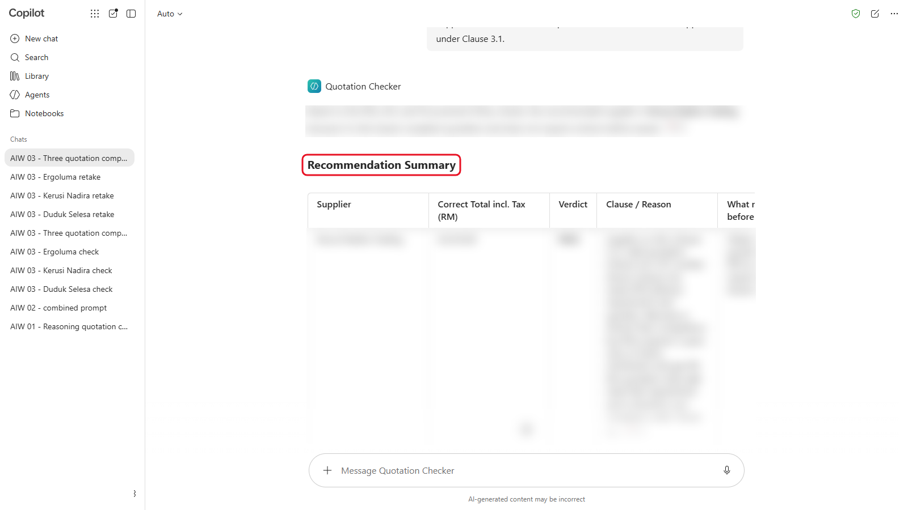

   *Caption to write after capture.*
   -->

2. Before you accept the recommendation, check two things yourself: the arithmetic you found in 3.3, and the warranty and payment terms against the RFQ and the policy.

   <!-- Screenshot still to capture: 03-12-before-accept-recommendation-check.png. Remove this comment wrapper when the image is added.
   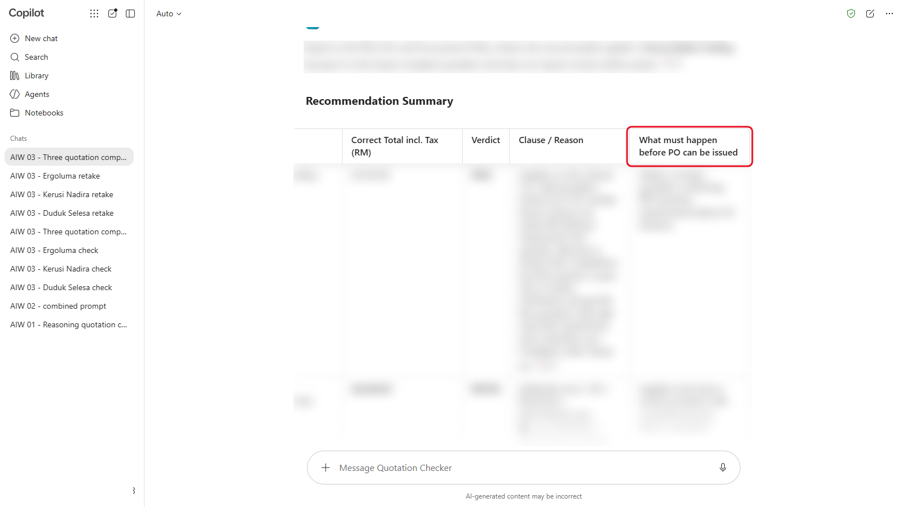

   *Caption to write after capture.*
   -->

<details markdown="1">
<summary>Show the answers</summary>

| Supplier | Problem | Clause | What happens next |
|---|---|---|---|
| Duduk Selesa | Line 1 printed as RM42,800.00, but 120 x RM365.00 is RM43,800.00. Correct grand total RM47,628.00, not RM46,548.00 | 4.4 | Ask for a revised quotation. Don't correct it yourself |
| Kerusi Nadira | Warranty is 3 years on the frame and 1 year on the mechanism and gas lift; the RFQ asks for 5 years on all three | 4.3 | Non-compliant. Ask for a revised quotation or exclude it |
| Ergoluma | 50% deposit; the limit is 30% | 6.2 | Needs the Finance Director's written approval, or ask for standard terms |

Under your instructions, Ergoluma's verdict is **ESCALATE**: its only problem is the deposit, and ESCALATE is the verdict for anything that needs the Finance Director. If your Checker says REVISE, it has picked the other way forward (asking for standard terms) instead of following its own verdict list. Note it: you'll test the verdicts properly in Module 07.

Recommended: **Duduk Selesa**, once it sends a revised quotation at RM47,628.00. That falls in the RM5,000 to RM50,000 band (3.1): three quotations and a comparison, approved by the HOD and the Head of Procurement.

Kerusi Nadira is cheapest, which is why a Checker that ranks on price alone gets this wrong.

Watch for one more slip: a Checker can find the arithmetic error in 3.3, then still list RM46,548.00 as the correct total in its recommendation. That's why step 2 asks you to check the arithmetic yourself.

</details>

> **Key point:** keep your Quotation Checker. You'll test it on ten new quotations in Module 07, break it in Module 11 and rebuild it as a workflow in Module 10.

---

## Product Notes

| Copilot Chat (Basic) | M365 Copilot (Premium) | ChatGPT | Claude | Gemini |
|---|---|---|---|---|
| **Agents** > **New agent** > **Skip**. Instructions only: upload the policy and vendor list in each chat. At most three files per message | Same, and you can add the policy and vendor list as agent knowledge | Personal plans: a **Project** with instructions and files (up to 5 on Free). Business and Enterprise may build a GPT | A **Project** with instructions and knowledge files (up to 5 Projects on Free) | Personal: a **skill** (needs Keep Activity on; upload the PDFs in the chat). Workspace: a **Gem** with the PDFs as knowledge |

---

## Independent Practice

Think of a check you do often at work: approving a claim, reviewing a form, checking a report before it goes out. Write the five parts of an assistant for it (role, task, steps, output format, rules) without any real data. Which step would you least trust an AI to do?

---

## Troubleshooting

| Symptom | What to check |
|---|---|
| The report skips some checks | Ask: "Run all seven checks in your instructions, one row each." If it keeps skipping, check the instructions were saved in full |
| It says every quotation is valid | Check the evaluation date (10 November 2026) is in the instructions |
| It corrects the supplier's total without saying so | Ask it to show the printed figure and the correct one side by side, and remind it never to change a supplier's figures |
| It can't find the vendor list | Upload `approved-vendor-list.pdf` in the chat, or check it's in the assistant's knowledge |
| Two quotations get mixed up | Check each quotation in its own new chat |

---

## Lesson Summary

A custom assistant is instructions plus knowledge, saved so you can use them again. Clear instructions with steps, a fixed format and rules make its reports consistent, but not always right: your checker found some problems and you had to check others. That's why Module 07 tests it properly.

**Check yourself:** Which of the five parts of the instructions makes every report come back in the same layout, and why does that matter when you check ten quotations?
