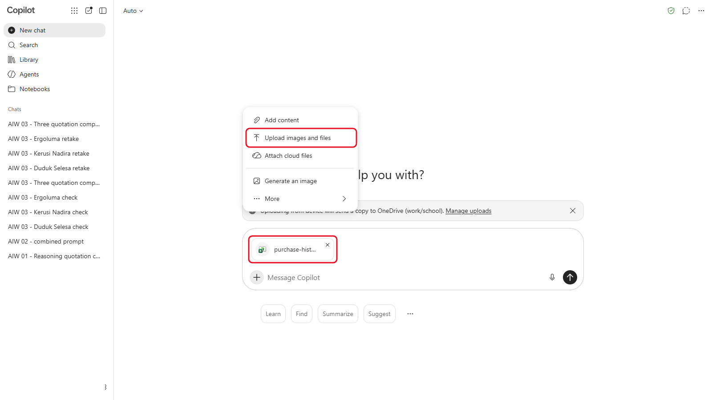
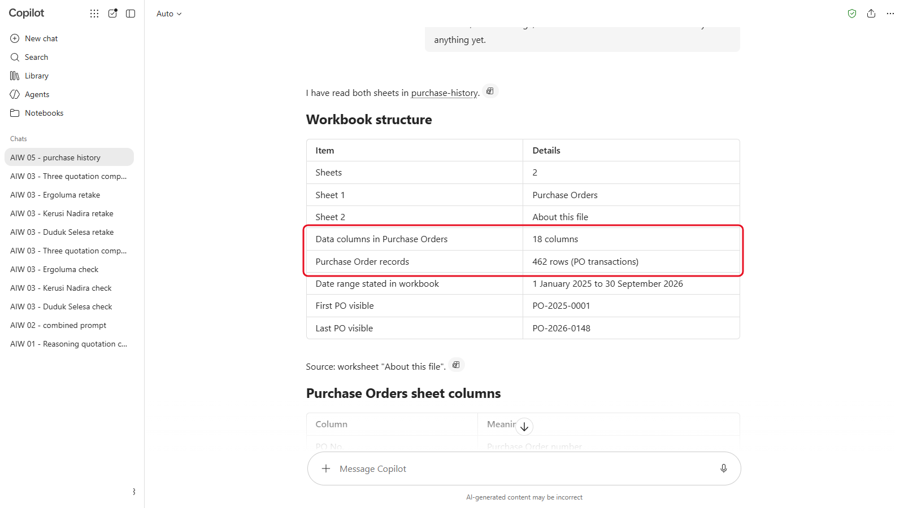
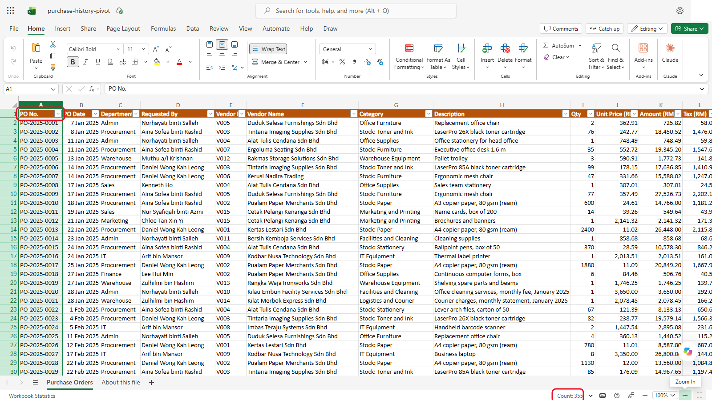
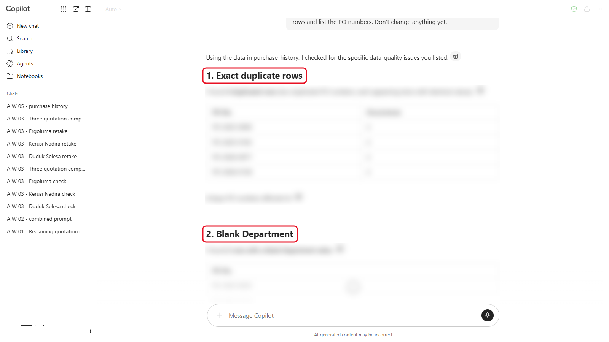
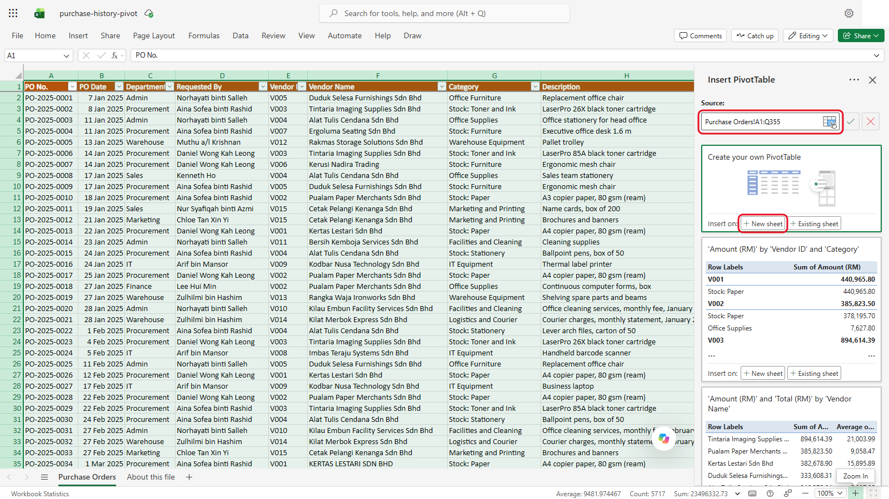
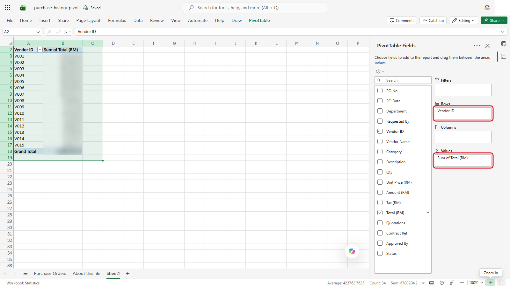
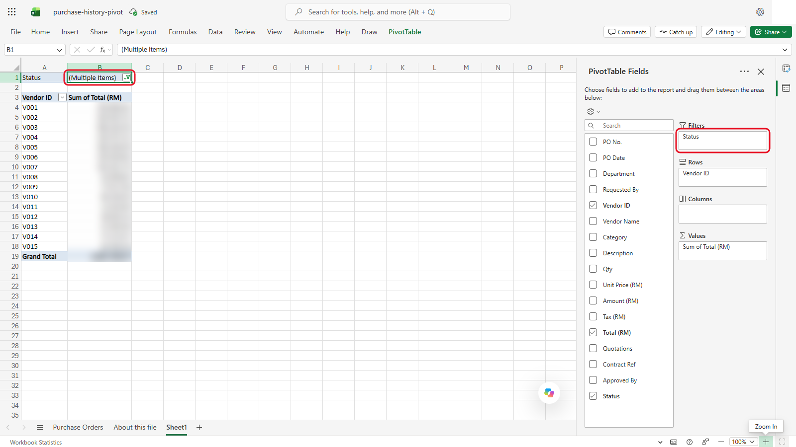
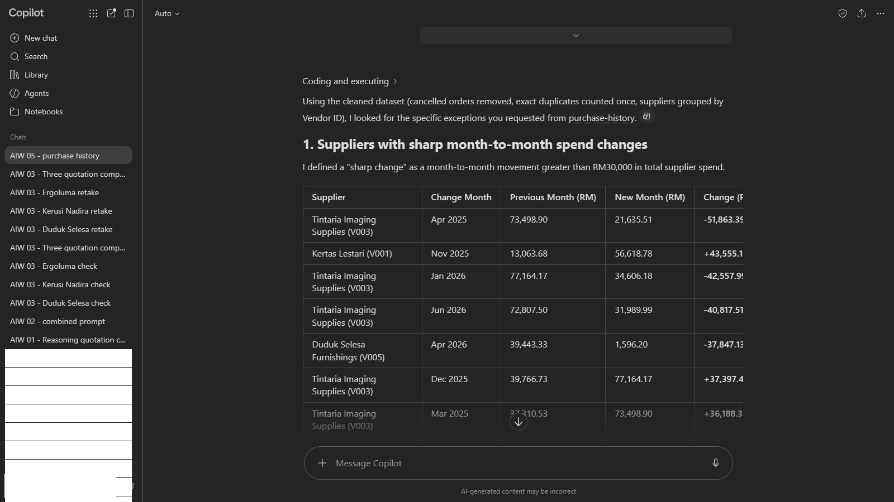
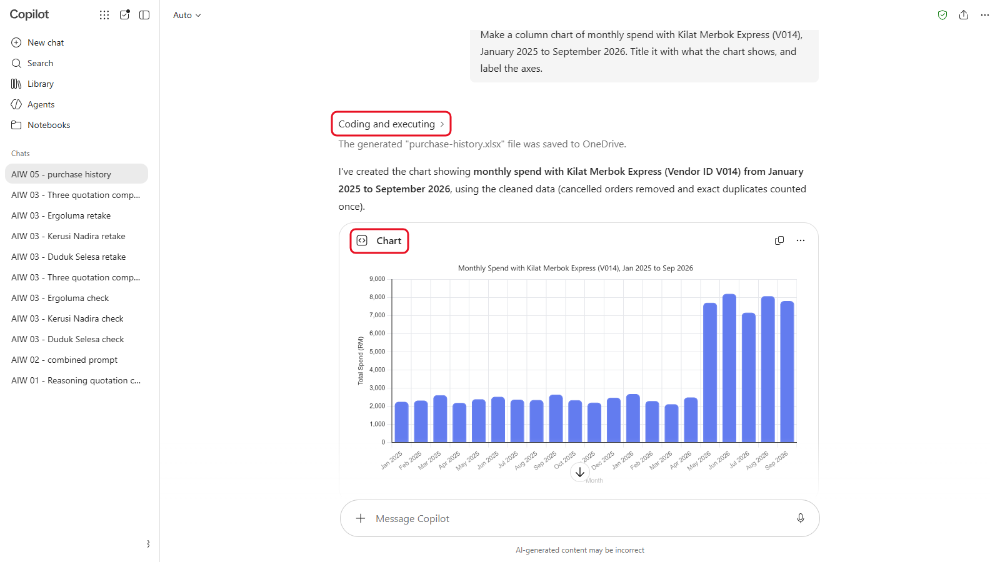

# 05 - Advanced Data Analysis with AI

The Finance Director wants to know where Sinar Maju's money goes, and whether anyone is getting round the procurement rules. You have 21 months of purchase orders in one spreadsheet. In this module you use AI to clean the data, summarise the spend and find the patterns a person would take a day to spot, and then you check its figures.

> **Prompts:** every prompt you need is in the steps, with a Copy button. The [prompts page](./prompts.md) has them all on one page too.

**Day:** 1

**Estimated time:** 55 minutes

**Your result:** A cleaned view of the purchase history, a spend summary you've checked in Excel, a list of findings for the Finance Director, and one chart.

---

## What You Will Learn

- Explain how AI tools analyse data: by running code, or by reading the text
- Find and deal with data problems before you analyse
- Define your measures so the AI calculates what you mean
- Ask for the method as well as the answer
- Check an AI figure against Excel in under a minute

---

## Before You Begin

Download **[sample-files.zip](./sample-files.zip)** and extract it. It holds the same data twice: `purchase-history.xlsx` (two sheets: the data, and **About this file**) and `purchase-history.csv`. Use the `.xlsx` unless your tool asks for CSV.

Have Excel open too. You'll use it to check one figure.

> **Important:** the data is fictional. At work, check your organisation allows the AI tool you're using to read financial data before you upload any.

---

## Topics

**Two ways to analyse.** Some tools write and run code (usually Python) on your file, then report the result: ChatGPT, Claude, Gemini and Copilot (Basic and Premium) work this way. Others read the file as text and estimate. Code is far more reliable for sums and counts. If your tool shows its code or working, it ran code.

**Clean first.** Real exports have duplicate rows, blanks, spelling variations and cancelled orders. Totals calculated on dirty data are wrong, however confident they look.

**Say exactly what to measure.** "Total spend" could mean before or after tax, with or without cancelled orders. Tell the AI which column to use and what to leave out. The **About this file** sheet tells you what each column means.

**Check one figure.** Pick one number and check it yourself in Excel with a filter or a PivotTable. If it matches, trust the method more. If it doesn't, ask the AI to explain the difference.

---

## 5.1 First Look at the Data

1. Start a new chat and upload `purchase-history.xlsx`.

   

   *Upload the `.xlsx` with **+** > **Upload images and files**.*
2. Send:

   ```
   This is Sinar Maju Sdn Bhd's purchase order export, January 2025 to September 2026. Read both sheets. Tell me how many rows and columns there are, the date range, and what each column means. Don't analyse anything yet.
   ```

   <!-- Screenshot still to capture: 05-02-send.png. Remove this comment wrapper when the image is added.
   

   *Caption to write after capture.*
   -->

3. Check the row count against Excel: select the PO No. column and read **Count** at the bottom of the window. It includes the header row, so subtract one.

   

   *Count shows 355: the header plus 354 data rows.*

If the numbers differ, believe Excel. In one test run, Copilot reported 462 rows and 18 columns for a file with 354 rows and 17 columns.

---

## 5.2 Find the Data Problems

In the same chat, send:

```
Before any analysis, check the data quality. Look for: rows that are exact duplicates, rows with a blank Department, the same supplier spelled in different ways, and cancelled orders. For each problem, tell me how many rows and list the PO numbers. Don't change anything yet.
```



*One heading per problem. The findings are blurred so you can compare with your own.*

<details markdown="1">
<summary>What should you see?</summary>

Before you analyse, the file needs cleaning:

- **Duplicates:** 4 rows repeat the row above exactly: PO-2025-0040, PO-2025-0192, PO-2026-0077 and PO-2026-0138.
- **Blank department:** 6 rows: PO-2025-0035, PO-2025-0153, PO-2026-0029, PO-2026-0075, PO-2026-0089 and PO-2026-0092.
- **Supplier name variants:** 7 Kertas Lestari rows are spelled "KERTAS LESTARI SDN BHD" or "Kertas Lestari Sdn. Bhd.". The Vendor ID (V001) is the same, so group by Vendor ID.
- **Cancelled orders:** 8 rows. Leave them out of spend.

If your counts are lower, ask the AI to list every PO number it found and compare with the lists above. In one test run, Copilot found all 4 duplicates and 7 variants but only 2 blank departments and 7 cancelled rows.

</details>

---

## 5.3 Summarise the Spend

In the same chat, send:

```
Now clean the data: count each duplicated row once, group suppliers by Vendor ID, and leave out cancelled orders. Using Total (RM), give me: the number of unique purchase orders, total spend, spend in 2025, spend from January to September 2026, the top five suppliers by spend, and spend by category with each category's share. Show the method you used.
```

Then check one figure yourself:

1. In Excel, select the data and choose **Insert** > **PivotTable**.

   

   *Check the source covers the whole table, then choose **New sheet**.*
2. Put **Vendor ID** in Rows and **Total (RM)** in Values.

   

   *Vendor ID in **Rows**, Total (RM) in **Values**.*
3. Filter **Status** to leave out Cancelled.

   

   *Status filtered to leave out Cancelled: the filter shows **(Multiple Items)**.*
4. Compare the total for **V003** with the AI's figure. They should match exactly.
5. Now compare **V005**. Your PivotTable is higher, because one V005 order appears twice in the file and Excel counts both. That's why you clean before you sum.

<details markdown="1">
<summary>What should you see?</summary>

Using **Total (RM)**, without cancelled orders, counting each duplicate once:

| Measure | Value |
|---|---|
| Purchase orders (unique) | 342 (350 before leaving out the 8 cancelled) |
| Total spend | RM3,281,457.86 |
| Spend in 2025 | RM1,930,291.38 |
| Spend January to September 2026 | RM1,351,166.48 |

| Top suppliers | Spend |
|---|---|
| Tintaria Imaging Supplies (V003) | RM966,183.56 |
| Kertas Lestari (V001) | RM459,896.83 |
| Pualam Paper Merchants (V002) | RM404,697.46 |
| Duduk Selesa Furnishings (V005) | RM335,418.16 |
| Alat Tulis Cendana (V004) | RM330,183.52 |

The biggest category is Stock: Toner and Ink (RM966,183.56, 29.4%), then Stock: Paper (RM857,246.33, 26.1%).

</details>

---

## 5.4 Look for Patterns

In the same chat, send:

```
Look for anything the Finance Director should know about. In particular:
1. Any supplier whose monthly spend changed sharply. When did it change, and by how much?
2. Orders from the same department to the same supplier within 30 days that are each below RM5,000 but add up to RM5,000 or more.
3. Orders of RM5,000 or more (Total) with fewer than 3 quotations and no Contract Ref.
4. Orders of RM5,000 or more approved only by a department head, not the Head of Procurement.
5. Any seasonal pattern in paper purchases.
For each finding, list the PO numbers and the figures.
```

<!-- Screenshot still to capture: 05-08-look-patterns.png. Remove this comment wrapper when the image is added.


*Caption to write after capture.*
-->

Check at least one finding yourself: filter the spreadsheet to the PO numbers the AI lists.

<details markdown="1">
<summary>Show the answers</summary>

- **Courier spend jumped in May 2026.** Kilat Merbok Express averaged RM2,388.10 a month until April 2026, then RM7,792.98 a month from May (about 3.3 times). It's under a contract, so no new quotations were needed (3.3), but it's worth asking why.
- **Split purchases.** Admin bought from Duduk Selesa three times in a week (PO-2026-0028, PO-2026-0032 and PO-2026-0036, RM14,547.60 together). IT bought from Kodbar Nusa on 18 and 19 August 2026 (PO-2026-0125 and PO-2026-0126, RM9,882.00 together). Each order was just under RM5,000 with one quotation (7.1 and 7.2).
- **Too few quotations.** PO-2025-0167 (RM8,640.00, 2 quotations) and PO-2026-0071 (RM12,409.20, 1 quotation). Both needed three (3.1).
- **Wrong approver.** PO-2026-0071 was approved by the Marketing HOD alone. It also needed the Head of Procurement.
- **Seasonal paper.** A4 paper orders in November, December and January average 4,720 reams a month, against 2,471 in other months.

If a finding is missing, ask about it directly, for example `Compare Kilat Merbok Express's average monthly spend before and after April 2026.` For the paper pattern, ask for average reams a month, not total spend: some months appear twice in the 21-month file, so totals by month mislead.

</details>

---

## 5.5 Make One Chart

In the same chat, send:

```
Make a column chart of monthly spend with Kilat Merbok Express (V014), January 2025 to September 2026. Title it with what the chart shows, and label the axes.
```

<!-- Screenshot still to capture: 05-09-make-chart.png. Remove this comment wrapper when the image is added.


*Caption to write after capture.*
-->

Check that the chart's jump matches the month in your finding. If your 5.4 answer missed the jump, the chart is where you spot it: don't accept the AI saying it found it earlier. Download the chart or take a screenshot for your notes.

---

## Product Notes

| Copilot Chat (Basic) | M365 Copilot (Premium) | ChatGPT | Claude | Gemini |
|---|---|---|---|---|
| Upload the `.xlsx` in a chat. Copilot runs Python on it: open **Coding and executing** above the answer to see the code | **Analyst** runs code on the file. Or open it in Excel and use Copilot there | Runs code on the file and can draw charts. Free has a data analysis limit | Turn on file creation (code execution) under **Settings** > **Capabilities** first. Runs code and draws charts | Upload the file in a chat. Ask it to show its working |

<!-- VERIFY: whether Gemini shows its code, October 2026. Copilot Basic running Python was confirmed in the Module 05 capture. -->

---

## Independent Practice

Ask one more question you'd want answered about this data, such as "Which department spends most on stationery?" Then check the answer with a PivotTable before you believe it.

---

## Troubleshooting

| Symptom | What to check |
|---|---|
| The totals don't match your PivotTable | Ask the AI which rows it included, and whether it removed duplicates and cancelled orders |
| It finds no duplicates | Ask it to compare complete rows, all 17 columns, not only the PO number |
| It can't open the `.xlsx` | Upload `purchase-history.csv` instead |
| It reports a pattern but no PO numbers | Ask: "List the PO numbers behind that finding." A finding you can't trace isn't a finding |
| It stops partway through | The analysis hit a limit. Ask for one part at a time |

---

## Lesson Summary

AI can clean, summarise and search a spreadsheet in minutes, especially when it runs code. It only calculates what you ask for, so define your measures and ask it to clean first. And one quick check in Excel tells you whether to trust the rest.

**Check yourself:** The AI says total spend is higher than your cleaned figure. Name two things in this file that could explain it.
