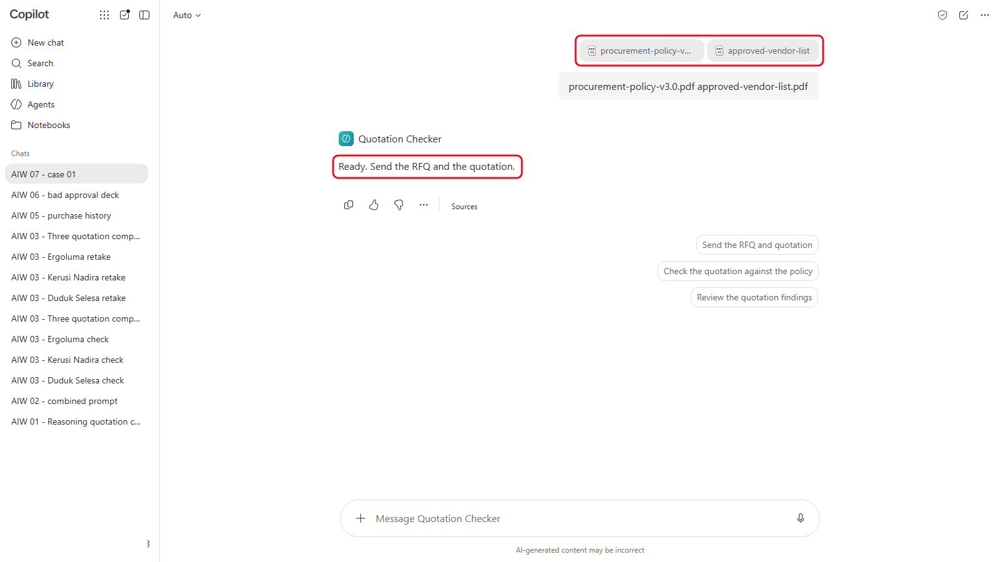
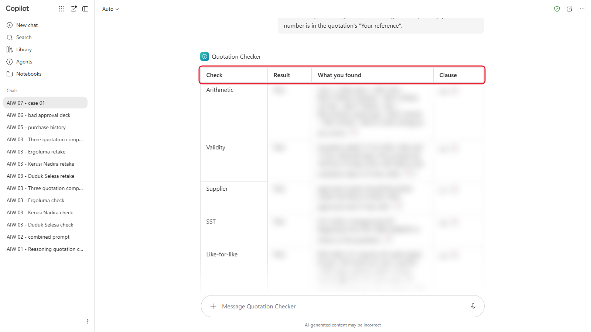
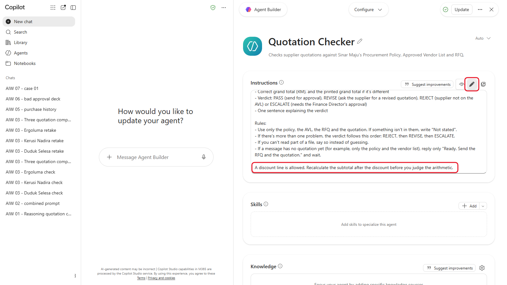
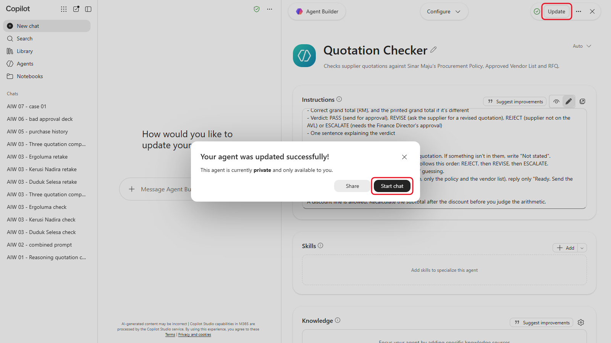

# 07 - Evaluating AI Output

Your Quotation Checker gave sensible reports on three chair quotations. Is that enough to trust it with the next fifty? In this module you test it properly: ten quotations with known answers, a score, and one improvement you can prove made it better.

> **Prompts:** every prompt you need is in the steps, with a Copy button. The [prompts page](./prompts.md) has them all on one page too.

**Day:** 1

**Estimated time:** 45 minutes

**Your result:** A completed scoresheet for your Quotation Checker on ten test cases, its score out of 20, and an improved version of its instructions.

---

## What You Will Learn

- Build a test set with expected results before you test
- Score an assistant's verdicts and its reasons separately
- Tell a false positive from a false negative, and which costs more
- Change one thing at a time, and re-run every test after a change

---

## Before You Begin

You need your **Quotation Checker** from Module 03. Download **[sample-files.zip](./sample-files.zip)** and extract it. It holds:

| File | What it is |
|---|---|
| `open-rfqs.pdf` | Five open requests for quotation (RFQ-2026-121 to RFQ-2026-125) |
| `case-01-...pdf` to `case-10-...pdf` | Ten supplier quotations, two for each RFQ |
| `procurement-policy-v3.0.pdf`, `approved-vendor-list.pdf` | The same policy and vendor list as Module 03 |

Some of the ten quotations comply with the policy and some don't. Don't open them to look for the problems first: the point is to see what the Checker finds on its own.

---

## Topics

**Test before you trust.** "It looked right on three examples" isn't evidence. A test set is a fixed group of cases where you know the right answer before the AI sees them, so you can measure it.

**Two kinds of mistake.** A **false negative** passes a quotation that should fail: the costly mistake, because a bad quotation gets through. A **false positive** fails a good one: it wastes time and teaches people to ignore the Checker. Good test sets include both kinds of trap.

**Score the reason, not only the verdict.** "Fail" for the wrong reason is luck. Give one point for the right verdict and one for the right clause.

**Change one thing at a time.** When you improve the instructions, re-run all ten cases, not only the one that failed. A fix for one case can break another. That's called regression testing.

---

## 7.1 Set Up Your Scoresheet

Copy this table into Word, Excel or a notepad:

| Case | Supplier | Checker verdict | Pass or Fail | Clause given | Verdict right? (1/0) | Clause right? (1/0) |
|---|---|---|---|---|---|---|
| 01 | | | | | | |
| 02 | | | | | | |
| 03 | | | | | | |
| 04 | | | | | | |
| 05 | | | | | | |
| 06 | | | | | | |
| 07 | | | | | | |
| 08 | | | | | | |
| 09 | | | | | | |
| 10 | | | | | | |

The Checker's verdict **PASS** counts as Pass. **REVISE**, **REJECT** and **ESCALATE** all count as Fail.

---

## 7.2 Run the Ten Cases

For each case, 01 to 10:

1. Start a **new chat** with your Quotation Checker. If it has no files of its own, upload the policy and the vendor list first.

   

   *Each case starts in a new chat. The Checker waits for the quotation.*
2. Upload `open-rfqs.pdf` and the case's quotation, and send:

   ```
   Check this quotation against the matching RFQ in open-rfqs.pdf. The RFQ number is in the quotation's "Your reference".
   ```

   

   *Case 01's report. Score the verdict and the clause, not how tidy it looks.*

3. Fill in the Checker verdict, Pass or Fail, and the clause it gives.

> **Tip:** working in pairs, split the cases: one person runs 01 to 05, the other 06 to 10. Then swap scoresheets to check.

---

## 7.3 Score the Checker

Open the box only once all ten rows are filled in. Give 1 point for each right verdict and 1 for each right clause.

<details markdown="1">
<summary>Show the answers</summary>

| Case | Supplier | Expected | Clause | Why |
|---|---|---|---|---|
| 01 | Kertas Lestari | Pass | | Meets the RFQ, figures correct |
| 02 | Pualam Paper | Fail | 4.4 | Subtotal printed as RM17,820.00; the lines add up to RM17,280.00 |
| 03 | Tintaria | Pass | | The 5% discount is correct. Flagging it is a false positive |
| 04 | Dakwat Seroja | Fail | 5.1 | Not on the Approved Vendor List |
| 05 | Imbas Teraju | Fail | 4.2 | Expired on 5 November 2026 |
| 06 | Kodbar Nusa | Pass | | The cradle is a separate line, still like-for-like |
| 07 | Bersih Kemboja | Fail | 4.5 | Charges SST with no SST registration number |
| 08 | Kilau Embun | Pass | | 30% advance is exactly at the limit. Flagging it is a false positive |
| 09 | Rakmas | Fail | 4.3 | 250 kg per level; the RFQ asks for 300 kg |
| 10 | Rangka Waja | Fail | 4.2 and 6.2 | Valid only 14 days (expired 30 October 2026) and asks for a 50% deposit |

Four pass, six fail. Score 1 point for each right verdict and 1 for each right clause, out of 20. Case 10 needs both problems for both points.

</details>

Then answer:

1. How many false negatives (should fail, passed) did your Checker make? Which cases?
2. How many false positives (should pass, failed)? Which cases?
3. Which of those would cost Sinar Maju more?

---

## 7.4 Improve One Thing and Test Again

1. Pick the one mistake that matters most.
2. Open your Quotation Checker's instructions and change **one** thing. For example, add a rule:

   ```
   A discount line is allowed. Recalculate the subtotal after the discount before you judge the arithmetic.
   ```

   or:

   ```
   An advance of exactly 30% is within the limit. Only more than 30% fails Clause 6.2.
   ```

   

   *One new rule, added at the end of the instructions.*

3. Save the instructions.

   

   *Select **Update** to save. Then re-run all ten cases.*
4. Re-run **all ten** cases and score them again.

Did your score go up? Did any case that was right before go wrong? Keep the better version of the instructions: you'll use it in Modules 10 and 11.

---

## Product Notes

| Copilot Chat (Basic) | M365 Copilot (Premium) | ChatGPT | Claude | Gemini |
|---|---|---|---|---|
| Upload the policy and vendor list first, then `open-rfqs.pdf` and the case (three files per message at most). Edit the agent from **Agents** | Same, with the policy as agent knowledge | Run each case as a new chat inside your Project. Edit instructions in **Project settings** | Run each case as a new chat inside your Project. Edit the project instructions | Skill: edit it under **Skills**. Gem: edit the Gem's instructions |

---

## Independent Practice

Pick an AI task you rely on at work. Write five test cases where you know the right answer, including at least one false-positive trap. How would you score it?

---

## Troubleshooting

| Symptom | What to check |
|---|---|
| The Checker checks against the wrong RFQ | Tell it the RFQ number from the quotation's "Your reference" |
| A verdict depends on something the Checker can't see | Check the policy, the vendor list and `open-rfqs.pdf` were all in the chat or the assistant's files |
| Every case passes | Check the evaluation date (10 November 2026) is still in the instructions |
| The score went down after your change | Your change broke something else. Undo it, and try a narrower rule |
| You run out of time | Score the cases you finished. Five well-scored cases teach more than ten rushed ones |

---

## Lesson Summary

Testing an assistant means fixed cases, known answers and a score for both the verdict and the reason. Traps for false positives matter as much as traps for false negatives. Change one thing at a time, and re-run every case after each change.

**Check yourself:** Your change fixed case 03 but broke case 02. What do you do next?
