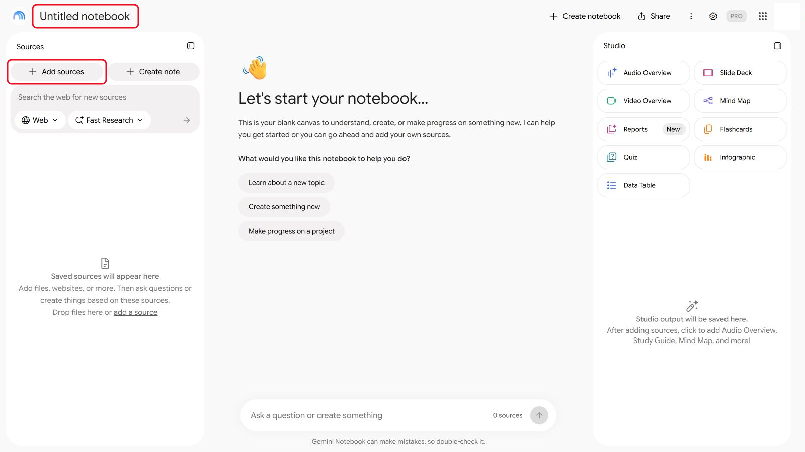
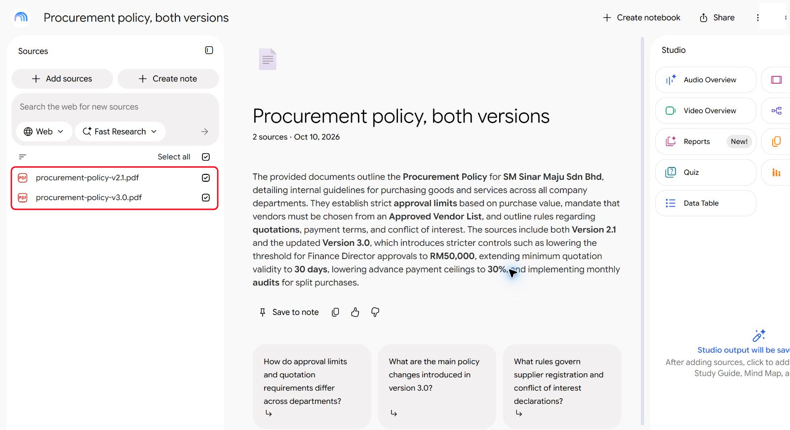
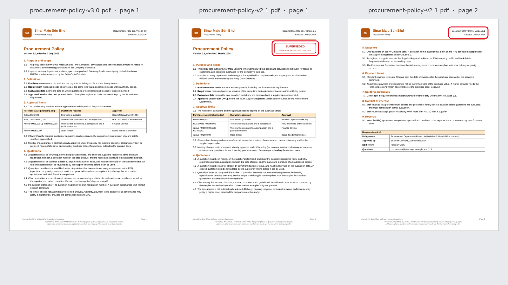
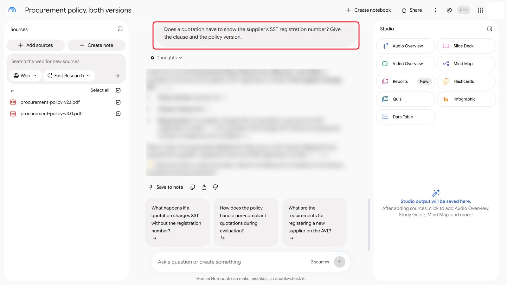
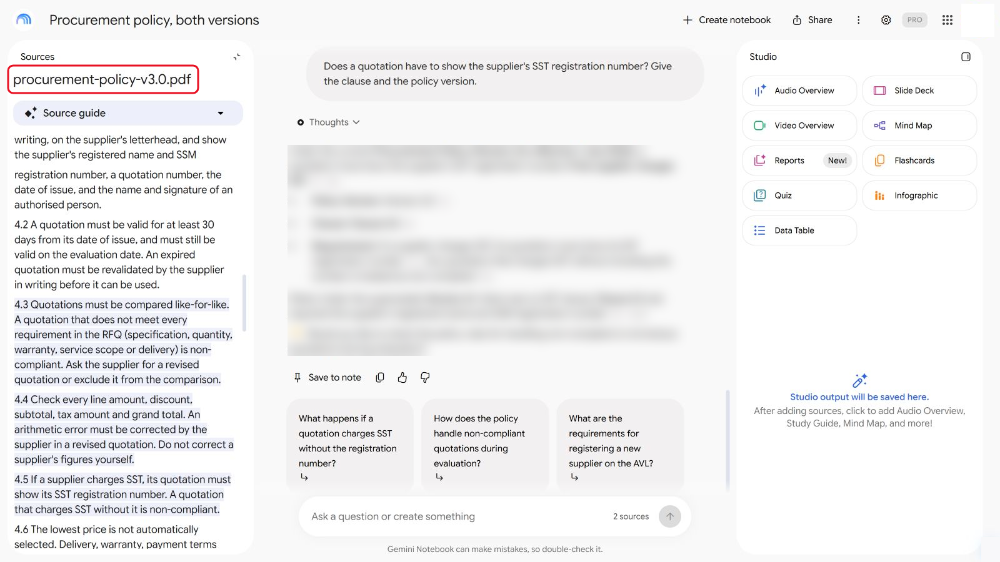
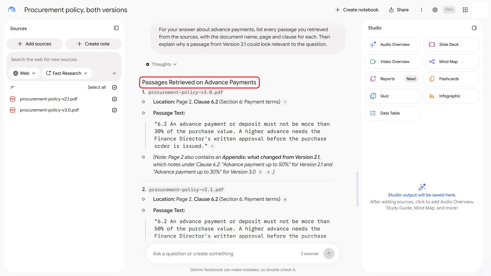
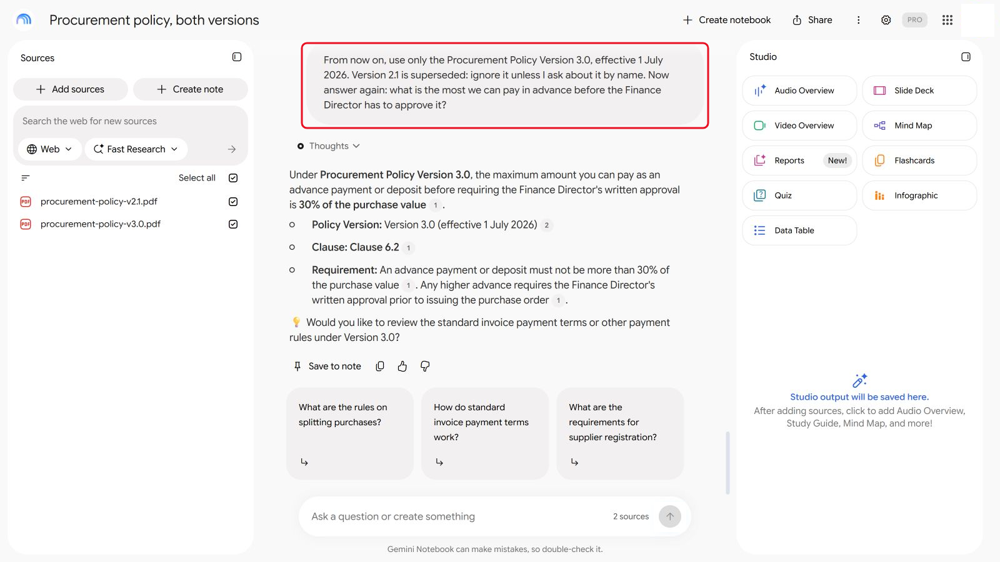

# 09 - Retrieval-Augmented Generation (RAG) Fundamentals

In Module 04 your policy notebook gave good answers with citations. Then someone adds an old copy of the policy to the same notebook, because it was in the shared folder. In this module you see what happens to the answers, work out why the AI cited the wrong document, and fix it.

> **Prompts:** every prompt you need is in the steps, with a Copy button. The [prompts page](./prompts.md) has them all on one page too.

**Day:** 2

**Estimated time:** 50 minutes

**Your result:** A diagnosis of a wrong citation in plain words, and a notebook you've fixed so it answers from the current policy only.

---

## What You Will Learn

- Explain retrieval-augmented generation (RAG) in four steps: split, index, retrieve, answer
- Say why a RAG tool can cite the wrong document with full confidence
- Diagnose a wrong citation by checking what was retrieved
- Fix it, by curating the sources or by telling the tool which version wins

---

## Before You Begin

Download **[sample-files.zip](./sample-files.zip)** and extract it. It holds:

| File | What it is |
|---|---|
| `procurement-policy-v3.0.pdf` | The current Procurement Policy, effective 1 July 2026 |
| `procurement-policy-v2.1.pdf` | The previous version, effective 1 March 2024 |

Use a source-grounded notebook, as in Module 04. Gemini Notebook (formerly NotebookLM) shows its citations most clearly.

---

## Topics

**RAG in four steps.** Notebooks and Projects with files work like this:

1. **Split:** each document is cut into small chunks, often a few paragraphs each.
2. **Index:** each chunk is turned into a list of numbers that captures its meaning, so similar chunks can be found quickly.
3. **Retrieve:** when you ask a question, the tool finds the chunks whose meaning is closest to it.
4. **Answer:** the model writes an answer from those chunks only, and cites them.

**Why citations go wrong.** The tool retrieves by meaning, not by date or version. Two policy versions with the same clause numbers and nearly the same wording look equally relevant. A chunk from page 2 doesn't carry page 1's "SUPERSEDED" stamp with it. So the AI can quote an out-of-date clause, correctly, from the wrong document.

**Fixes.** The best fix is to remove superseded documents from the sources. If you can't, put the version and status in every chunk (a header on every page helps), and tell the tool which version wins.

---

## 9.1 Add Both Versions to a Notebook

1. Create a new notebook called `Procurement policy, both versions`.

   

   *A new notebook, separate from the one in Module 04.*
2. Add `procurement-policy-v3.0.pdf` and `procurement-policy-v2.1.pdf` as sources.

   

   *Both versions are sources. The summary already mentions both.*
3. Look at page 1 of each PDF. Only the old one has a red **SUPERSEDED** box. Now look at page 2 of the old one.

   

   *Only page 1 of the old policy says SUPERSEDED. Page 2 says Version 2.1 in small print, and nothing else.*

---

## 9.2 Ask Four Questions

Ask each question on its own. For every answer, note the figure it gives and **which version** it cites.

```
Answer from the sources, with the clause number and the version of the policy you used. What is the most we can pay in advance before the Finance Director has to approve it?
```

```
How long must a supplier's quotation be valid for? Give the clause and the policy version.
```

```
Who has to approve a purchase of RM80,000 including tax? Give the clause and the policy version.
```

```
Does a quotation have to show the supplier's SST registration number? Give the clause and the policy version.
```



*Ask each question on its own. The answer is blurred: compare with your own.*

---

## 9.3 Find the Wrong Citations

1. For each answer, click or open the citation and find the page it points to.

   

   *Click a citation to open the passage. The file name at the top tells you which version it came from.*
2. Check the version in the page header: **Version 3.0** or **Version 2.1**.
3. Mark each answer **Right** (from v3.0) or **Wrong** (from v2.1, or a mix of both).

Your results may differ from your neighbour's: retrieval varies from run to run.

<details markdown="1">
<summary>Show the answers</summary>

The wrong answers come from Version 2.1, which says SUPERSEDED only on its first page.

| Question | Right answer (v3.0) | Wrong answer (from v2.1) | Clause |
|---|---|---|---|
| Most you can pay in advance without extra approval? | 30% | 50% | 6.2 |
| How long must a quotation be valid? | At least 30 days | At least 14 days | 4.2 |
| Who approves a RM80,000 purchase? | Finance Director | HOD and Head of Procurement | 3.1 |
| Must a quotation show an SST number? | Yes, if SST is charged | A clause about the lowest price | 4.5 |

The clause numbers are the same in both versions, which is why a wrong citation looks right. Open the cited page and check the version in its header.

If every answer came from Version 3.0, your notebook retrieved well this time. In our test Gemini Notebook answered all four from Version 3.0 and even noted what Version 2.1 had said. Retrieval varies, so ask the same questions in different words (see Troubleshooting), and compare with your neighbours: the risk is that you can't predict which run will slip.

</details>

---

## 9.4 Diagnose Why

In the same notebook, send:

```
For your answer about advance payments, list every passage you retrieved from the sources, with the document name, page and clause for each. Then explain why a passage from Version 2.1 could look relevant to the question.
```



*The notebook lists the passages it retrieved: Clause 6.2 from both versions.*

Then, with the person next to you, write one sentence for each:

1. Which step of RAG (split, index, retrieve, answer) let the old clause in?
2. What on the page could have warned the AI, and why didn't it see it?

---

## 9.5 Fix It Two Ways

**Fix A: tell the tool which version wins.** In the same notebook, send:

```
From now on, use only the Procurement Policy Version 3.0, effective 1 July 2026. Version 2.1 is superseded: ignore it unless I ask about it by name. Now answer again: what is the most we can pay in advance before the Finance Director has to approve it?
```



*Fix A: tell the notebook which version wins, then ask again.*

**Fix B: curate the sources.** Remove `procurement-policy-v2.1.pdf` from the notebook's sources, and ask the four questions again.

Which fix would you trust in six months' time, when someone else asks the notebook a question?

> **Key point:** instructions help, but the reliable fix is the source list. Keep superseded documents out of the knowledge an AI answers from, or label them clearly on every page.

---

## Product Notes

| Copilot Chat (Basic) | M365 Copilot (Premium) | ChatGPT | Claude | Gemini |
|---|---|---|---|---|
| A **Notebook** with both PDFs. Open citations with the **Sources** button | Same. Researcher can also search your organisation's files, where old versions are a real risk | A **Project** with both PDFs. Remove a file from the project files for Fix B | A **Project** with both PDFs in its knowledge. Large knowledge bases use RAG automatically on paid plans | **Gemini Notebook**: untick or delete a source for Fix B. Click a citation number to see the passage |

---

## Independent Practice

Think of a shared folder at work that holds several versions of the same document. If someone pointed an AI notebook at that folder, which question would most likely get an out-of-date answer?

---

## Troubleshooting

| Symptom | What to check |
|---|---|
| Every answer cites Version 3.0 | Good retrieval this time. Ask the same question in different words, such as "What deposit can a supplier ask for?" |
| The answer doesn't name a version | Ask: "Which version of the policy did that come from? Check the page header." |
| The citation opens the wrong page | Search the PDF for the clause number yourself and check both versions |
| Fix A didn't change the answer | Start a new chat in the notebook and give the instruction first |

---

## Lesson Summary

RAG finds passages that match your question by meaning, then answers from them. It doesn't know which document is current unless the passage says so. Wrong citations usually come from the sources, not the model, so the fix starts with keeping old versions out.

**Check yourself:** Both policies have a Clause 6.2. Why does that make a wrong citation harder to spot?
