# 10 - Building an AI Agent Workflow in n8n

On Day 1 you checked quotations by uploading them to your Quotation Checker one at a time. In this module you rebuild it as a workflow in **n8n**: a quotation comes in, AI checks it, the workflow sends it down one of four routes, and nothing goes further until a person clicks **Approve**. This is the systems map from Module 08, built for real.

> **Prompts:** every prompt you need is in the steps, with a Copy button. The [prompts page](./prompts.md) has them all on one page too.

**Day:** 2

**Estimated time:** 90 minutes

**Your result:** A working n8n workflow that reads a quotation PDF, checks it with AI, routes it to approve, revise, reject or escalate, and waits for your approval by email.

---

## What You Will Learn

- Explain the parts of a workflow: trigger, nodes, data passed between them
- Import a workflow and test it one step at a time
- Add an AI step that returns structured data (JSON), not just text
- Combine AI with plain rules where a rule is more reliable
- Put a person's approval in front of every action that matters

---

## Before You Begin

You need:

- the n8n access your trainer sent you before Day 2 (a trial account or a class workspace)
- your **Quotation Checker** instructions from Module 03 (and your improvements from Module 07)
- an email account you can send test messages to yourself from
- **[sample-files.zip](./sample-files.zip)**, extracted

| File | What it is |
|---|---|
| `quotation-approval-starter.json` | A half-built workflow to import |
| `rfq-2026-131.pdf` | The RFQ for 60 paper shredders |
| `quotation-alat-tulis-cendana.pdf`, `quotation-kodbar-nusa.pdf`, `quotation-hancur-rapi.pdf`, `quotation-imbas-teraju.pdf` | Four quotations for that RFQ |
| `approved-vendors.csv`, `policy-limits.csv` | The vendor list and the policy limits, as data |
| `procurement-policy-v3.0.pdf` | The policy, for reference |

> **Important:** only send test emails to yourself. Start every training email subject with `[AIW TRAINING]`.

---

## Topics

**Workflow and agent.** A workflow runs the same steps in the same order every time. An agent decides its own steps. For a policy check, a workflow with one AI step is easier to test and to trust: the AI reads and judges, and the workflow decides what happens next.

**Nodes and data.** Each box in n8n is a **node**. The first one is the **trigger** (here, a form where someone uploads a PDF). Each node passes its output, as JSON, to the next, and you can open any node to see exactly what it received and produced.

**Structured output.** A Switch node can't read a paragraph. The AI step must return fields, such as `verdict: "revise"`, that the rest of the workflow can use. That's the JSON you practised in Module 02.

**Rules beside AI.** Is the supplier on the vendor list? A simple lookup answers that perfectly every time, so the workflow checks it with a rule, not with AI.

**Human in the loop.** **Send and Wait for Response** sends an email with **Approve** and **Disapprove** buttons and pauses the workflow until someone clicks one.

---

## 10.1 Import the Starter Workflow

1. Sign in to n8n with the details from your trainer.

   <!-- Screenshot still to capture: 10-01-sign-n8n-details-from.png. Remove this comment wrapper when the image is added.
   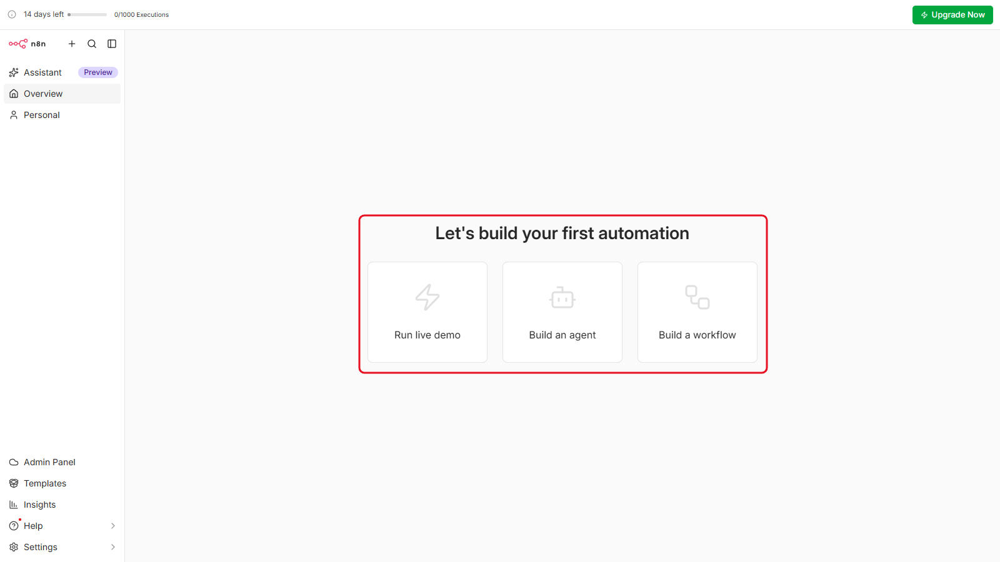

   *Caption to write after capture.*
   -->
2. Create a new workflow. Open the **...** menu at the top right and choose **Import from File**.

   <!-- Screenshot still to capture: 10-02-create-new-workflow-open.png. Remove this comment wrapper when the image is added.
   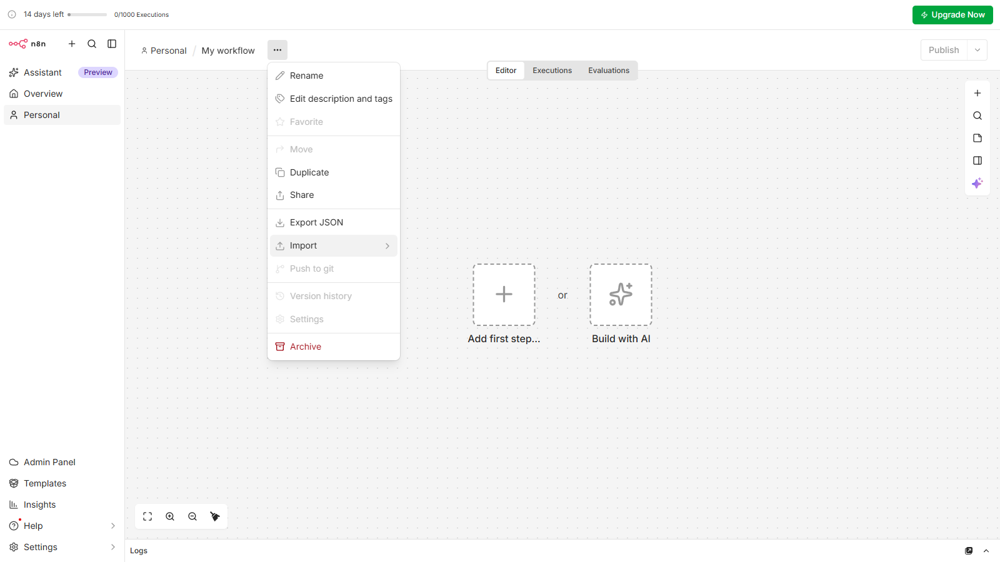

   *Caption to write after capture.*
   -->
3. Select `quotation-approval-starter.json`.

   <!-- Screenshot still to capture: 10-03-select-quotation-approval-starter.png. Remove this comment wrapper when the image is added.
   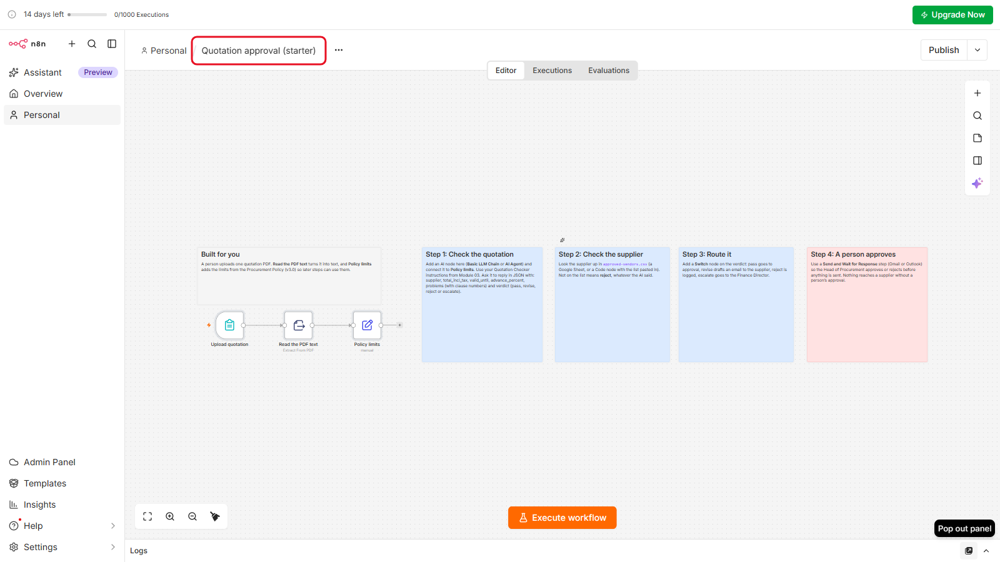

   *Caption to write after capture.*
   -->
4. You'll see three connected nodes (**Upload quotation**, **Read the PDF text**, **Policy limits**) and four sticky notes describing the steps you'll build.

   <!-- Screenshot still to capture: 10-04-ll-see-three-connected.png. Remove this comment wrapper when the image is added.
   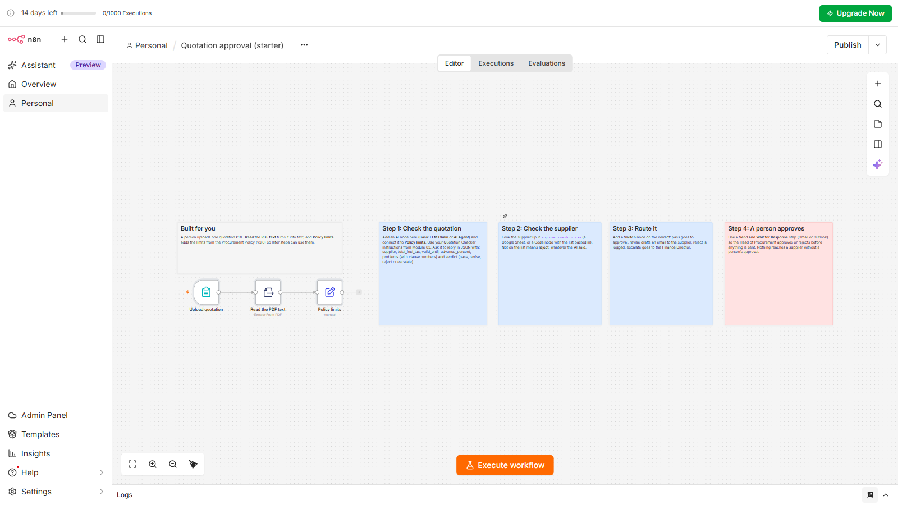

   *Caption to write after capture.*
   -->
5. Save the workflow.

   <!-- Screenshot still to capture: 10-05-save-workflow.png. Remove this comment wrapper when the image is added.
   

   *Caption to write after capture.*
   -->

<!-- VERIFY: import quotation-approval-starter.json into an n8n trial account (Workflows > Import from File). Check the three nodes connect, the form shows a PDF upload field, and Read the PDF text finds the file (binary field Quotation_PDF). Built against n8n's source in October 2026, not tested in n8n itself. -->

---

## 10.2 Test the First Three Nodes

1. Double-click **Upload quotation** and select **Test step** (or open the test form URL). A form opens in your browser.

   <!-- Screenshot still to capture: 10-06-double-click-upload-quotation.png. Remove this comment wrapper when the image is added.
   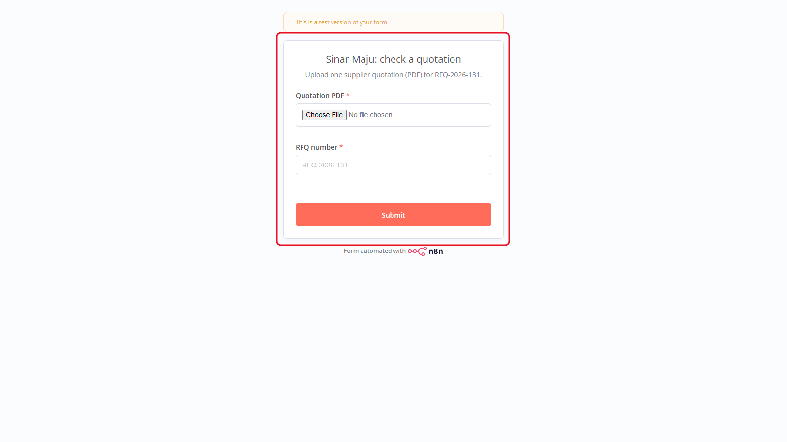

   *Caption to write after capture.*
   -->
2. Upload `quotation-alat-tulis-cendana.pdf`, type `RFQ-2026-131`, and submit.

   <!-- Screenshot still to capture: 10-07-upload-quotation-alat-tulis.png. Remove this comment wrapper when the image is added.
   

   *Caption to write after capture.*
   -->
3. Back in n8n, open **Read the PDF text**. Its output should show a field called `text` with the quotation's words.

   <!-- Screenshot still to capture: 10-08-back-n8n-open-read.png. Remove this comment wrapper when the image is added.
   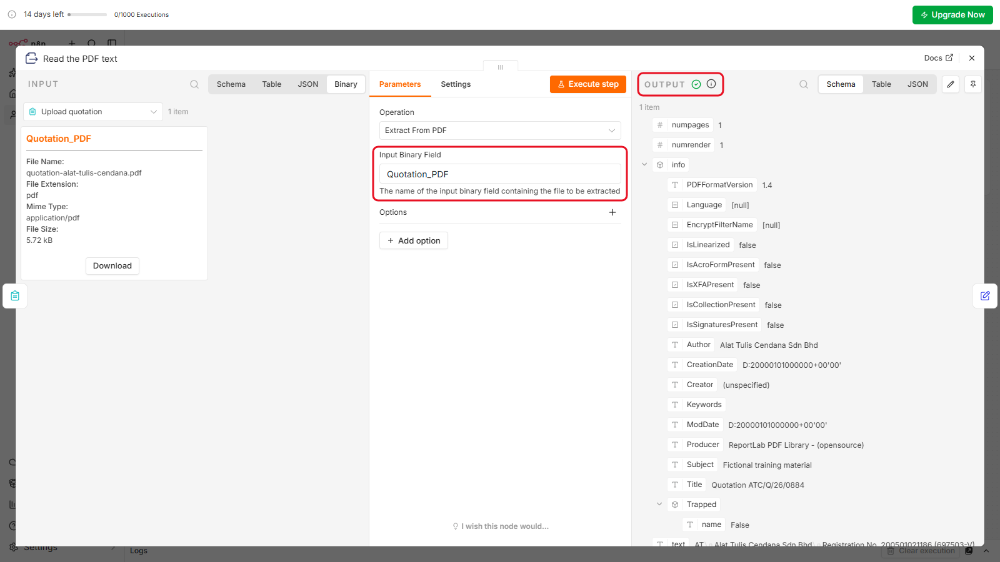

   *Caption to write after capture.*
   -->
4. Open **Policy limits**. Its output should show the same `text`, plus fields such as `max_advance_percent` and `finance_director_above_rm`.

   <!-- Screenshot still to capture: 10-09-open-policy-limits-its.png. Remove this comment wrapper when the image is added.
   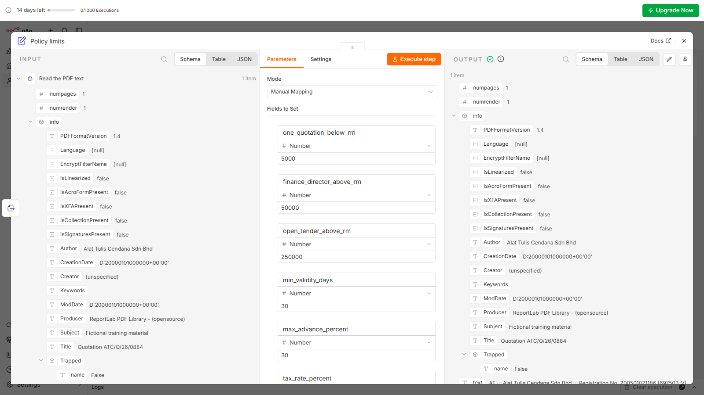

   *Caption to write after capture.*
   -->

> **If you don't see this:** if **Read the PDF text** says it can't find the file, open **Upload quotation**'s output, select **Binary**, and check the file's name there. Type that name into **Read the PDF text**'s **Input Binary Field**.

---

## 10.3 Add the AI Check

1. Select **+** after **Policy limits** and add a **Basic LLM Chain** node. Name it `Check the quotation`.

   <!-- Screenshot still to capture: 10-10-select-after-policy-limits.png. Remove this comment wrapper when the image is added.
   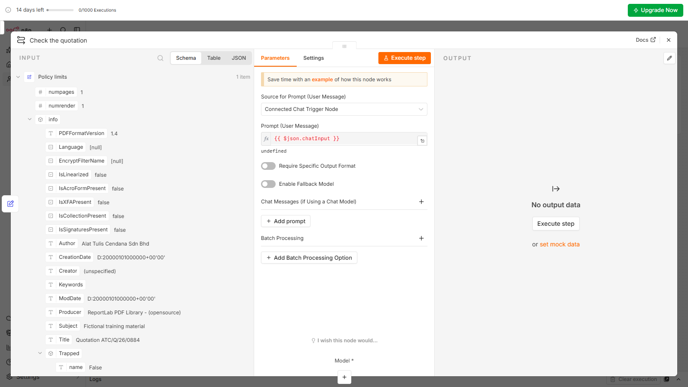

   *Caption to write after capture.*
   -->
2. Under **Model**, add a chat model (for example **OpenAI Chat Model**) and choose the credential your trainer gave you.

   <!-- Screenshot still to capture: 10-11-under-model-add-chat.png. Remove this comment wrapper when the image is added.
   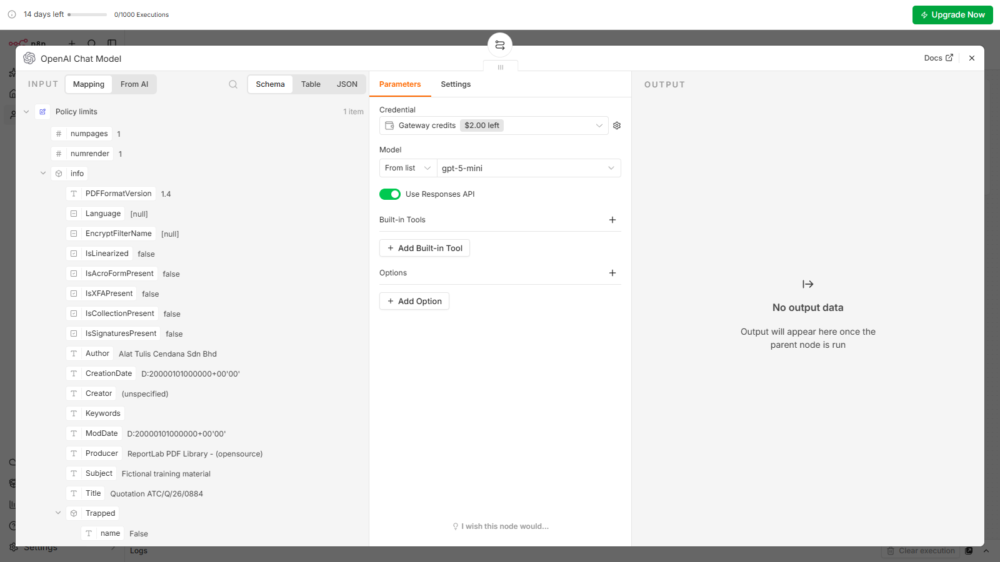

   *Caption to write after capture.*
   -->
3. Set the prompt source to define it yourself, and paste the **Part 1** prompt from the [prompts page](./prompts.md). It's your Checker instructions, adapted to read the quotation text from the previous node and the limits from **Policy limits**.

   <!-- Screenshot still to capture: 10-12-set-prompt-source-define.png. Remove this comment wrapper when the image is added.
   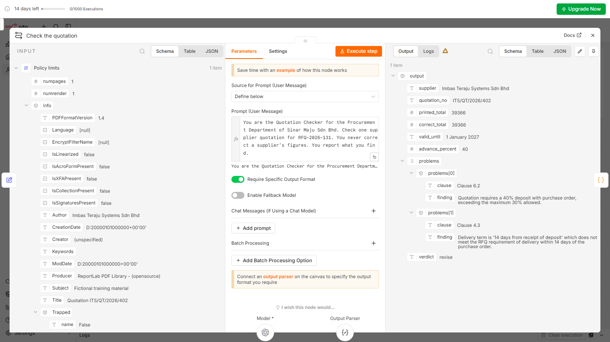

   *Caption to write after capture.*
   -->
4. Turn on **Require Specific Output Format**. Add a **Structured Output Parser**, choose to generate it from a JSON example, and paste the **Part 2** example from the prompts page.

   <!-- Screenshot still to capture: 10-13-turn-require-specific-output.png. Remove this comment wrapper when the image is added.
   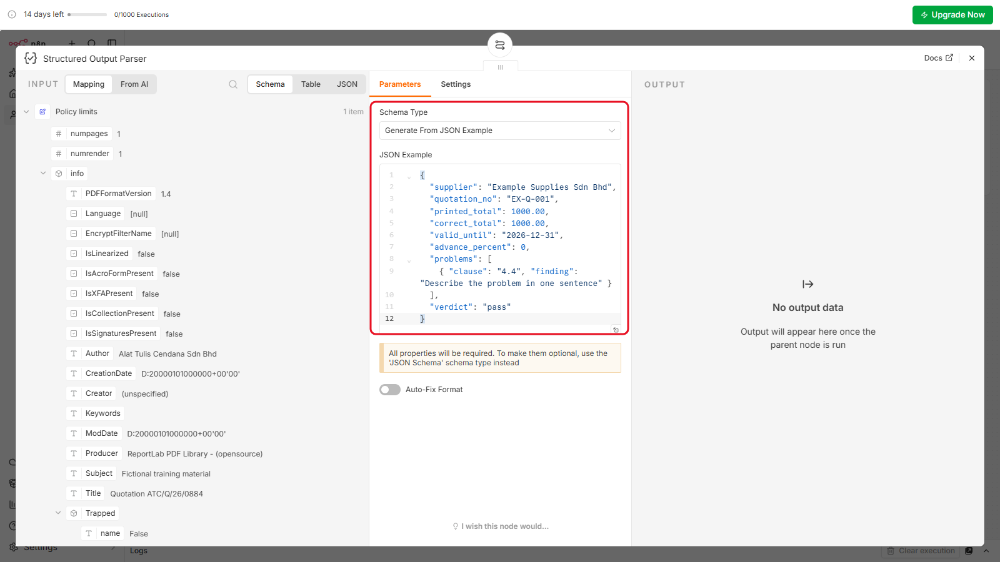

   *Caption to write after capture.*
   -->
5. Select **Test step**. The output should have an `output` object with `supplier`, `correct_total`, `problems` and `verdict`.

   <!-- Screenshot still to capture: 10-14-select-test-step-output.png. Remove this comment wrapper when the image is added.
   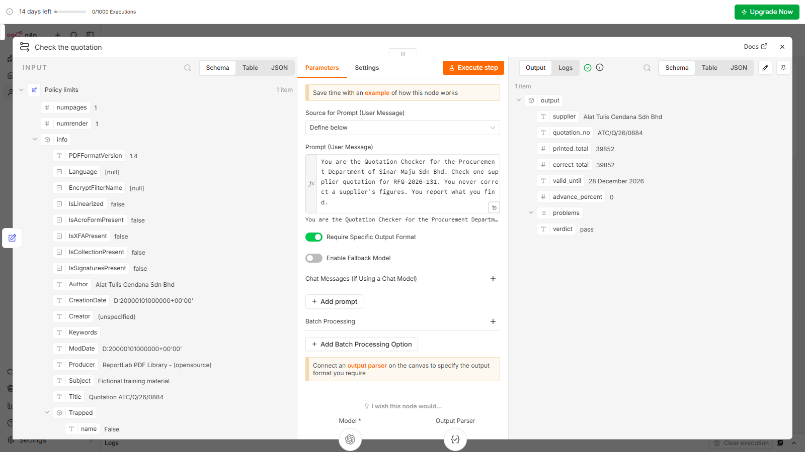

   *Caption to write after capture.*
   -->

<!-- VERIFY: Basic LLM Chain option labels (prompt source, Require Specific Output Format), the Structured Output Parser's "generate from JSON example" option, and whether n8n trial accounts include free AI credits or need a key from the trainer, October 2026. -->

---

## 10.4 Check the Supplier with a Rule

1. Add a **Code** node after **Check the quotation**. Name it `Check the vendor list`.

   <!-- Screenshot still to capture: 10-15-add-code-node-after.png. Remove this comment wrapper when the image is added.
   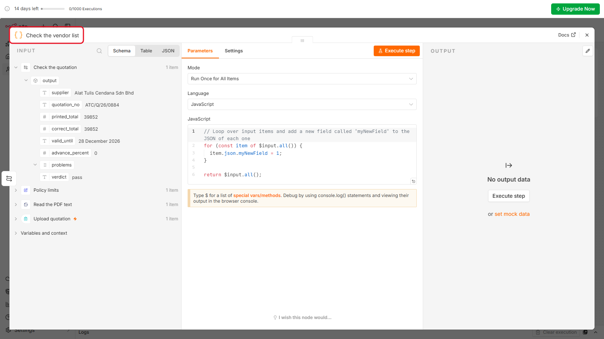

   *Caption to write after capture.*
   -->
2. Set the mode to **Run Once for Each Item** and the language to **JavaScript**.

   <!-- Screenshot still to capture: 10-16-set-mode-run-once.png. Remove this comment wrapper when the image is added.
   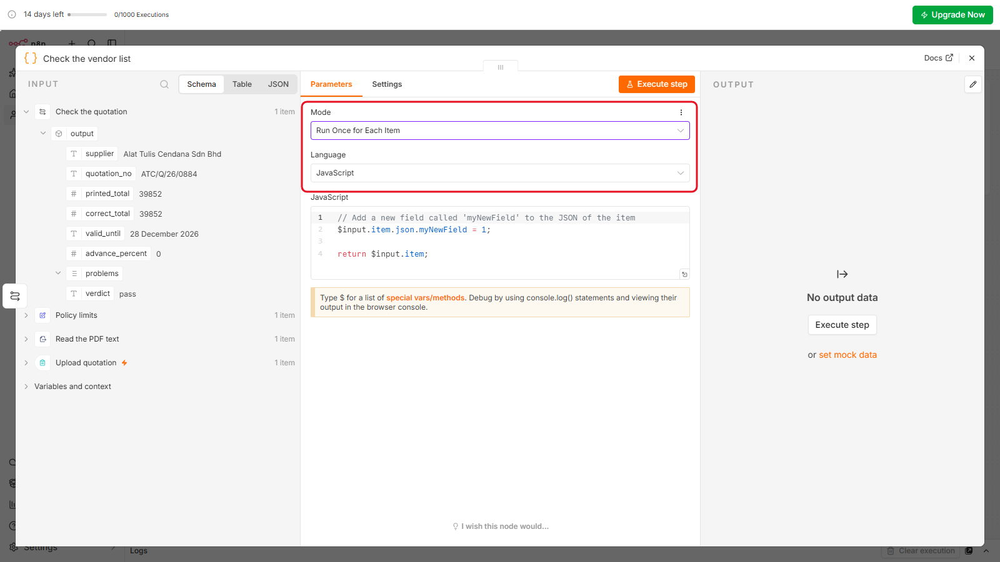

   *Caption to write after capture.*
   -->
3. Replace the code with the **Part 3** code from the prompts page. It holds the names from `approved-vendors.csv`, and it changes the verdict to `reject` if the supplier isn't on the list, whatever the AI said.

   <!-- Screenshot still to capture: 10-17-replace-code-part-3.png. Remove this comment wrapper when the image is added.
   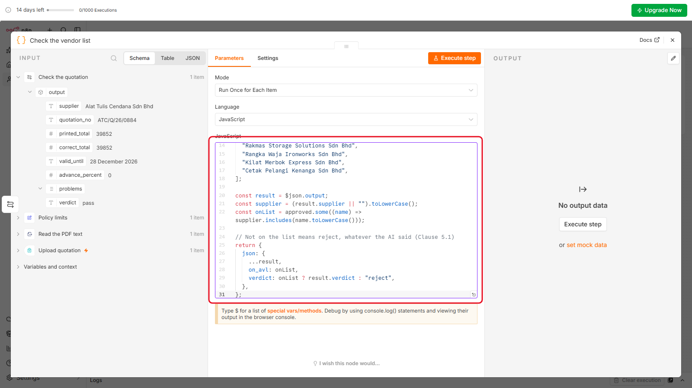

   *Caption to write after capture.*
   -->
4. Select **Test step** and check the output has `on_avl: true` for Alat Tulis Cendana.

   <!-- Screenshot still to capture: 10-18-select-test-step-check.png. Remove this comment wrapper when the image is added.
   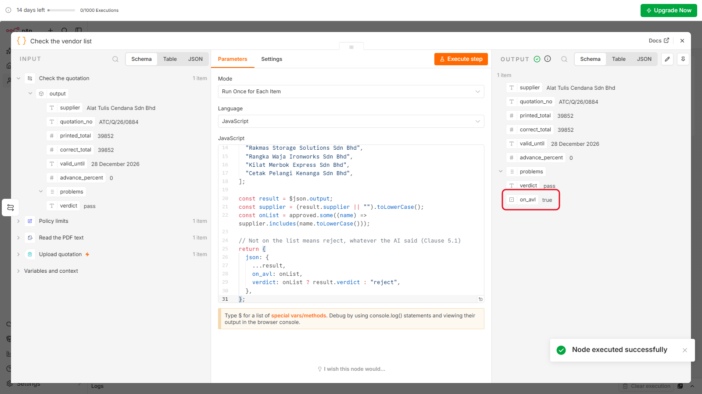

   *Caption to write after capture.*
   -->

---

## 10.5 Route by Verdict

1. Add a **Switch** node after **Check the vendor list**. Name it `Route`.

   <!-- Screenshot still to capture: 10-19-add-switch-node-after.png. Remove this comment wrapper when the image is added.
   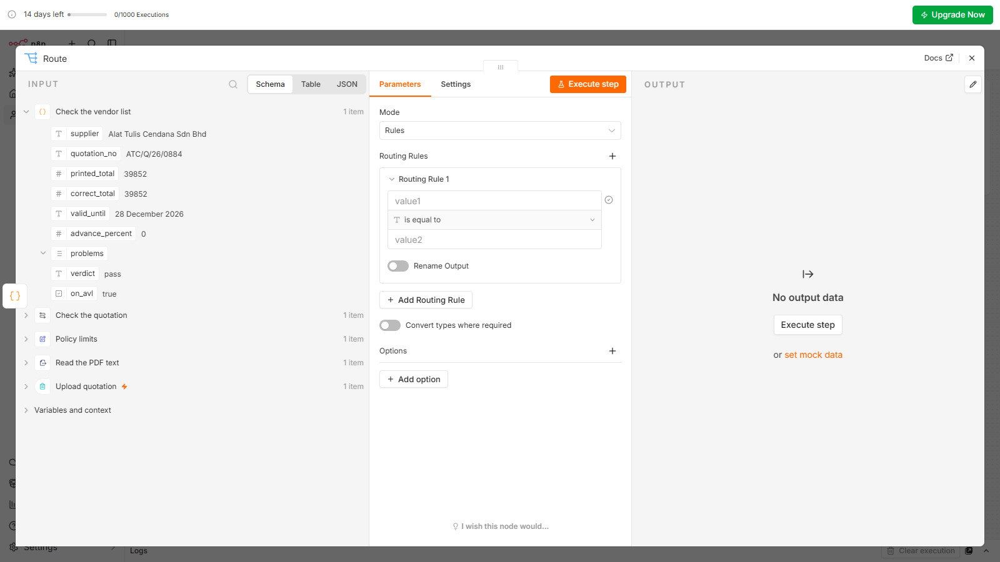

   *Caption to write after capture.*
   -->
2. Add four rules, each checking the value `{{ $json.verdict }}`:

   | Rule | Value equals | Rename the output to |
   |---|---|---|
   | 1 | `pass` | Approve |
   | 2 | `revise` | Revise |
   | 3 | `reject` | Reject |
   | 4 | `escalate` | Escalate |

   <!-- Screenshot still to capture: 10-20-add-four-rules-checking.png. Remove this comment wrapper when the image is added.
   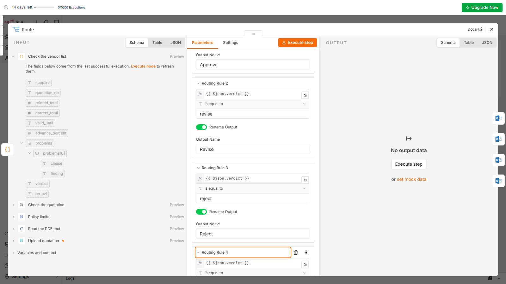

   *Caption to write after capture.*
   -->

3. Select **Test step**. Alat Tulis Cendana should come out of **Approve**.

   <!-- Screenshot still to capture: 10-21-select-test-step-alat.png. Remove this comment wrapper when the image is added.
   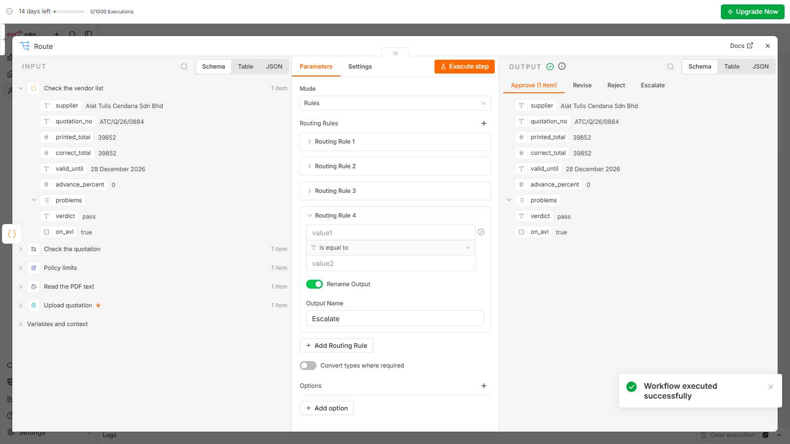

   *Caption to write after capture.*
   -->

---

## 10.6 Ask a Person to Approve

1. On the **Approve** output, add a **Gmail** (or **Microsoft Outlook**) node with the **Send and Wait for Response** operation. Connect your email account.

   <!-- Screenshot still to capture: 10-22-approve-output-add-gmail.png. Remove this comment wrapper when the image is added.
   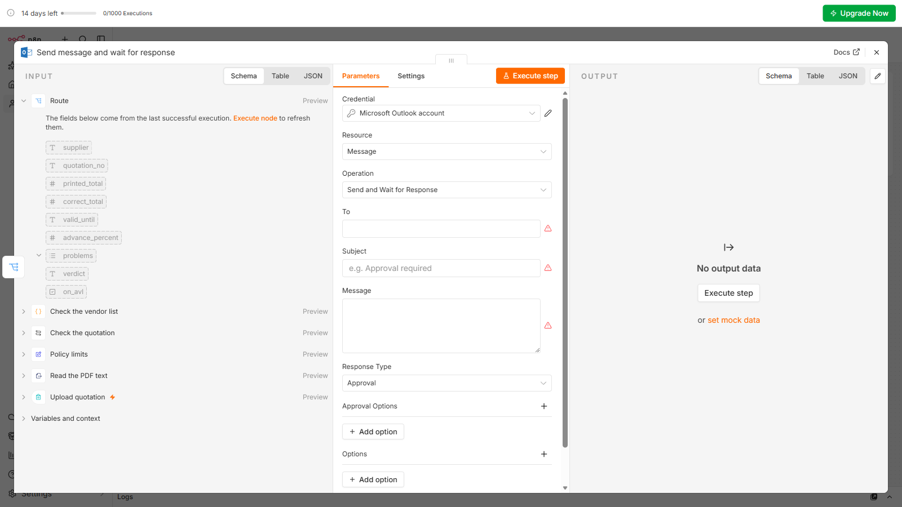

   *Caption to write after capture.*
   -->
2. Fill it in:
   - **To:** your own email address
   - **Subject:** `[AIW TRAINING] Approve: {{ $json.supplier }}`
   - **Message:** the **Part 4** message from the prompts page
   - **Response Type:** **Approval**

   <!-- Screenshot still to capture: 10-23-fill.png. Remove this comment wrapper when the image is added.
   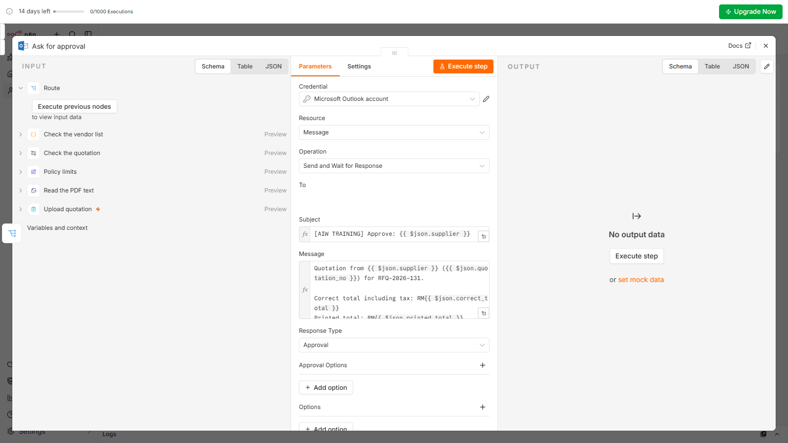

   *Caption to write after capture.*
   -->
3. Do the same on the **Escalate** output, with the subject `[AIW TRAINING] Finance Director approval: {{ $json.supplier }}`.

   <!-- Screenshot still to capture: 10-24-do-same-escalate-output.png. Remove this comment wrapper when the image is added.
   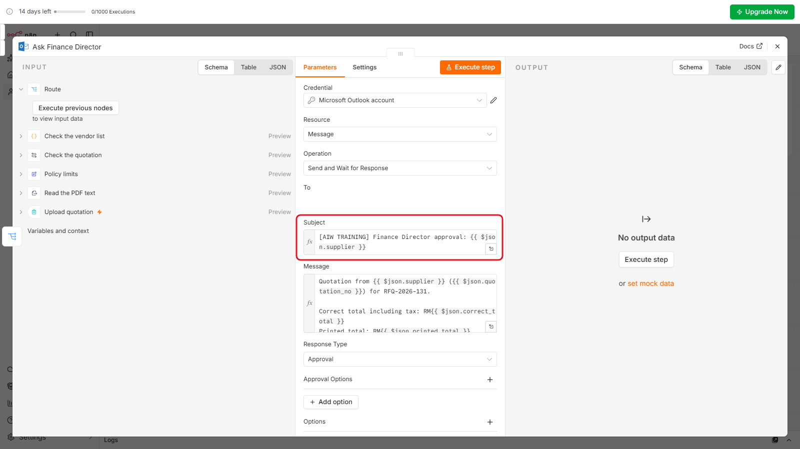

   *Caption to write after capture.*
   -->
4. On the **Revise** and **Reject** outputs, add a plain **Send** email to yourself saying what happened. (At work, Revise would draft an email to the supplier, and a person would send it.)

   <!-- Screenshot still to capture: 10-25-revise-reject-outputs-add.png. Remove this comment wrapper when the image is added.
   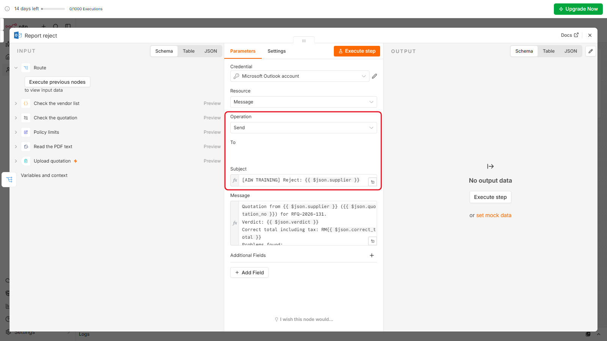

   *Caption to write after capture.*
   -->

<!-- VERIFY: that Send and Wait for Response is available in the Gmail and Microsoft Outlook nodes on n8n Cloud, and the label of the Approval response type. -->

---

## 10.7 Run All Four Quotations

1. Save the workflow. Open the form again (**Upload quotation** > **Test step**).

   <!-- Screenshot still to capture: 10-26-save-workflow-open-form.png. Remove this comment wrapper when the image is added.
   

   *Caption to write after capture.*
   -->
2. Upload each of the four quotations in turn, submitting the form once for each.

   <!-- Screenshot still to capture: 10-27-upload-four-quotations-turn.png. Remove this comment wrapper when the image is added.
   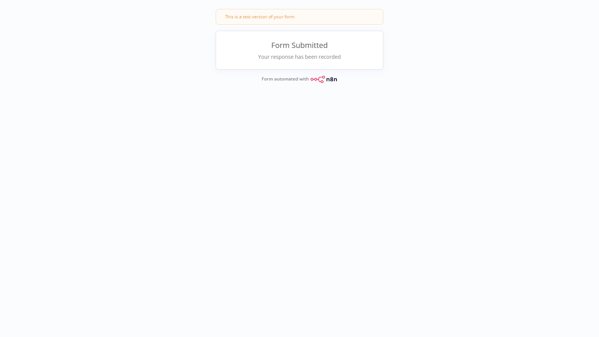

   *Caption to write after capture.*
   -->
3. After each one, check your inbox, and open the workflow's **Executions** to see which route it took.

   <!-- Screenshot still to capture: 10-28-after-check-inbox-open.png. Remove this comment wrapper when the image is added.
   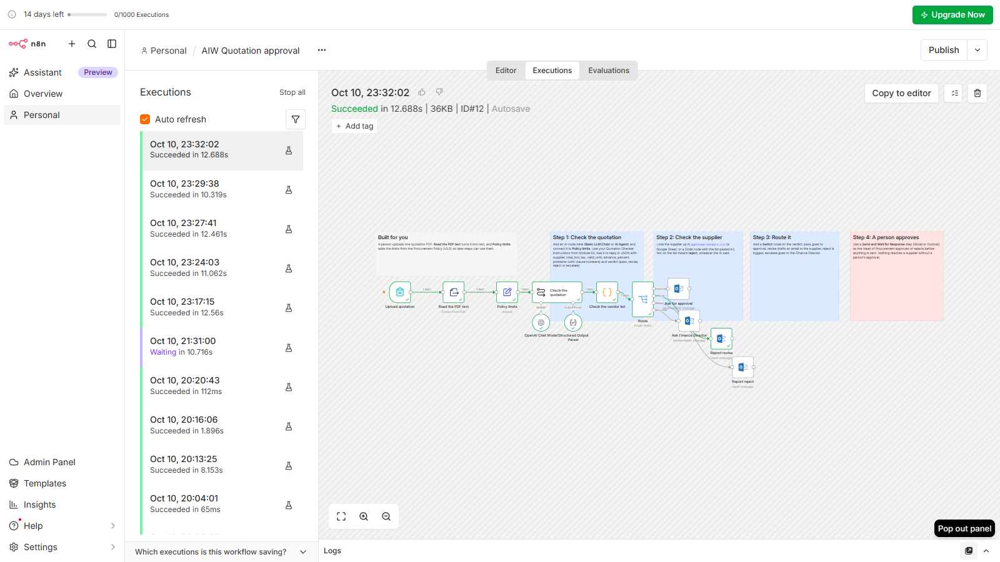

   *Caption to write after capture.*
   -->
4. For the approval emails, click **Approve** and watch the waiting execution finish.

   <!-- Screenshot still to capture: 10-29-approval-emails-click-approve.png. Remove this comment wrapper when the image is added.
   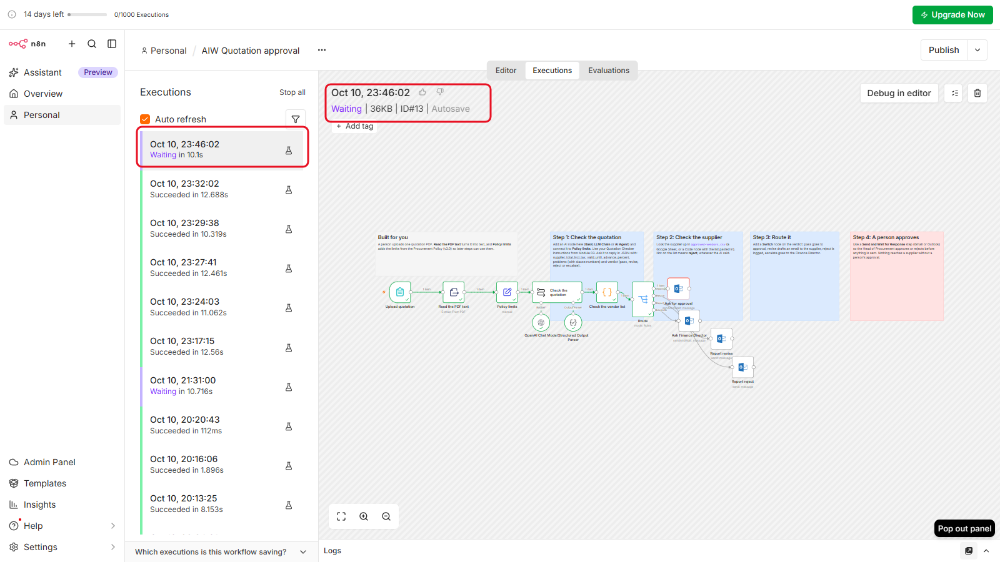

   *Caption to write after capture.*
   -->

Show the answers

Each quotation should take a different route through your workflow:

| Quotation | Route | Clause | Why |
|---|---|---|---|
| Alat Tulis Cendana | Send for approval | 3.1 | Meets the RFQ and the policy. RM39,852.00, so the HOD and the Head of Procurement approve |
| Kodbar Nusa | Ask for a revised quotation | 4.4 | Subtotal printed as RM36,800.00; the lines add up to RM36,080.00. Correct total RM38,966.40, not RM39,744.00 |
| Hancur Rapi Supplies | Reject and start supplier registration | 5.1 | Not on the Approved Vendor List, though it's the cheapest |
| Imbas Teraju | Escalate to the Finance Director | 6.2 | Asks for a 40% deposit; the limit is 30% |

Nothing should reach a supplier, or be approved, until a person clicks Approve in the Send and Wait step.

> **Key point:** the AI judged the quotation, a rule checked the vendor list, and a person approved. That split (AI for judgement, rules for facts, people for decisions) is what makes the workflow safe to use.

---

## Product Notes

n8n works the same whichever AI tool you use the rest of the time. The AI model inside the workflow comes from the credential your trainer gives you.

| Copilot Chat (Basic) | M365 Copilot (Premium) | ChatGPT | Claude | Gemini |
|---|---|---|---|---|
| Use Outlook for the approval emails if your organisation allows n8n to connect | The same workflow could be built in Copilot Studio or Power Automate with an approval step | The Chat Model can be OpenAI, if your trainer provides a key | The Chat Model can be Anthropic, if your trainer provides a key | The Chat Model can be Google Gemini, if your trainer provides a key. Use Gmail for the approval emails |

---

## Independent Practice

Add a fifth route: if `correct_total` is more than RM50,000, send it to Escalate even if the AI said pass. Should that be an AI judgement or a rule?

---

## Troubleshooting

| Symptom | What to check |
|---|---|
| **Read the PDF text** can't find the file | Check the binary field name in **Upload quotation**'s output, and type it into **Input Binary Field** |
| The AI step returns text, not fields | **Require Specific Output Format** is off, or the parser has no example. Turn it on and paste the Part 2 example |
| The Switch sends everything to one output | Open **Check the vendor list**'s output and check `verdict` is lower case: `pass`, `revise`, `reject` or `escalate` |
| Hancur Rapi Supplies comes out of Approve | Check the Code node runs after the AI step, and that its output says `on_avl: false` |
| No approval email arrives | Check the email node's credential, the **To** address, and your spam folder |
| The AI step fails with a quota or credential error | Tell your trainer: the class credential may have run out |

---

## Lesson Summary

A workflow turns your assistant into a process: a trigger, an AI check that returns structured data, a rule for the facts, a route for each verdict, and a person's approval before anything goes out. Each node shows its input and output, so you can test it one step at a time.

**Check yourself:** Why does the workflow check the vendor list with a Code node instead of asking the AI?
