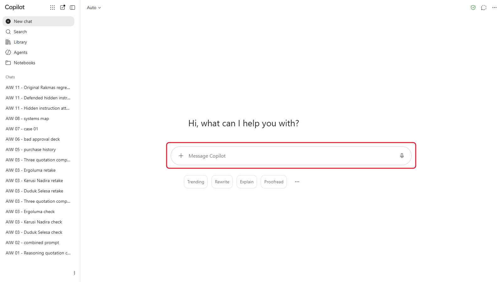
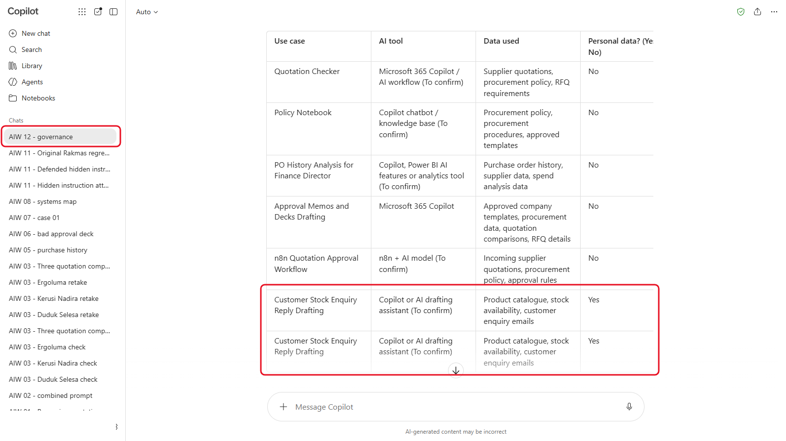
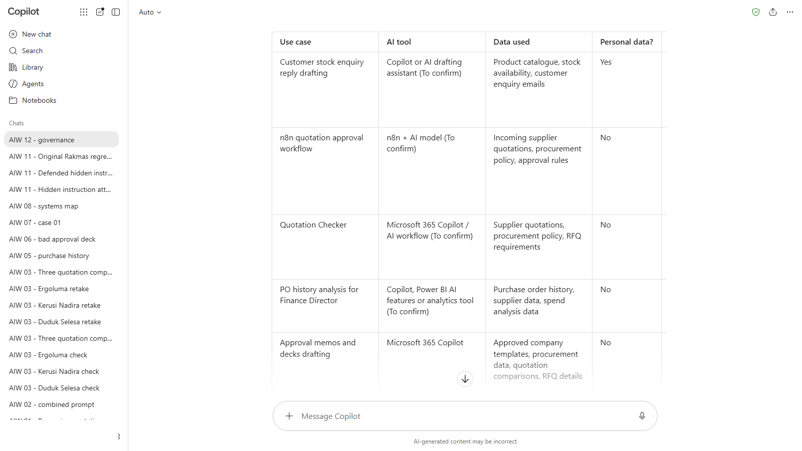
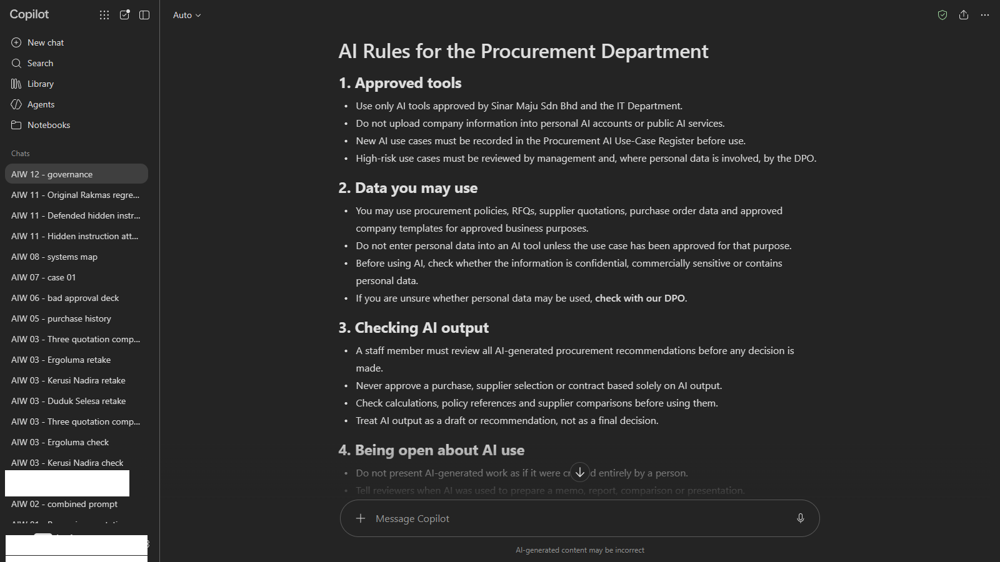
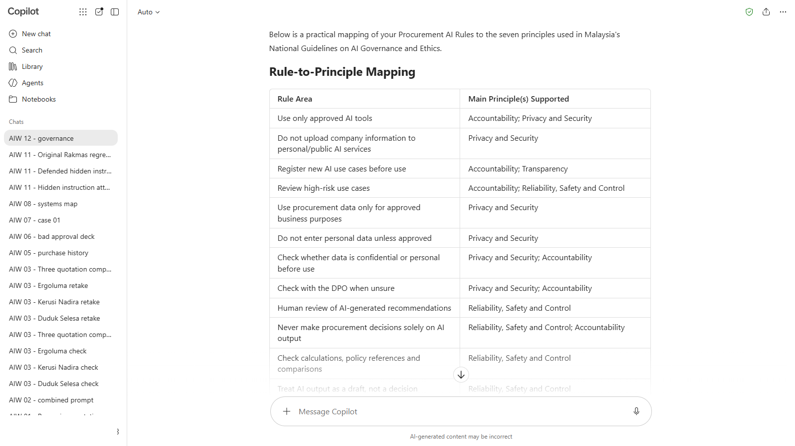

# 12 - AI Governance in the Malaysian Context

Over two days you've built a Quotation Checker, a policy notebook, a data analysis, templates and an approval workflow. If the whole Procurement Department started using them tomorrow, who decides which tools are allowed, what data goes in, and who checks the output? In this module you write the rules for your department, and a register of the AI uses those rules cover.

> **Prompts:** every prompt you need is in the steps, with a Copy button. The [prompts page](./prompts.md) has them all on one page too.

**Day:** 2

**Estimated time:** 45 minutes

**Your result:** A one-page set of AI rules for Sinar Maju's Procurement Department, and an AI use-case register with a risk rating and an owner for each use.

---

## What You Will Learn

- Describe the Malaysian rules and guidelines that shape AI use at work: the PDPA and its 2024 amendments, and the National Guidelines on AI Governance and Ethics
- Explain why governance belongs at department level, not only with IT
- Build an AI use-case register with a risk rating for each use
- Write department AI rules that people can follow
- Check your rules against the seven national AI principles

---

## Before You Begin

No files to download. Bring your notes from Day 1 and this morning: you'll list the AI uses you built.

> **Note:** this module explains the rules in general terms for training. It isn't legal advice. For a real decision, talk to your organisation's Data Protection Officer or legal team.

---

## Topics

**Why the department.** IT can approve a tool. Only the people who use it know what data goes in, what the output is used for, and where a mistake would hurt. Good AI governance is a short set of rules the team actually follows, and a list of what the team uses AI for.

**Personal data: the PDPA.** The Personal Data Protection Act 2010 applies whenever you process personal data in a commercial transaction, including pasting it into an AI tool. The Personal Data Protection (Amendment) Act 2024 added, from 1 June 2025: the duty to appoint a Data Protection Officer, the duty to notify the Personal Data Protection Commissioner of a personal data breach as soon as practicable (and the people affected, if it's likely to cause them significant harm), and a right to data portability.

**The national AI principles.** In September 2024 the Ministry of Science, Technology and Innovation (MOSTI) published the **National Guidelines on AI Governance and Ethics (AIGE)**. They're voluntary, and set seven principles:

1. Fairness
2. Reliability, safety and control
3. Privacy and security
4. Inclusiveness
5. Transparency
6. Accountability
7. Pursuit of human benefit and happiness

**What's coming.** Malaysia's National AI Office consulted the public on a proposed **AI Governance Bill** in July 2026. The draft is reported to take a risk-based approach, with duties for organisations that develop or deploy AI. It isn't law yet: on 5 October 2026 the Digital Minister told Parliament it was still being drafted, with tabling expected in early 2027. Check its status before you rely on it.

<!-- VERIFY: the AI Governance Bill's status (tabled, passed or still in draft) before each class. Checked 10 October 2026: still a draft, tabling expected in early 2027 (Digital Minister in Parliament, 5 October 2026). -->

**Read more:** [National Guidelines on AI Governance and Ethics (MOSTI, PDF)](https://mastic.mosti.gov.my/storage/2024/09/THE-NATIONAL-GUIDELINES-ON-AI-GOVERNANCE-ETHICS.pdf).

---

## 12.1 List the Department's AI Uses

1. Start a new chat in your AI tool.

   

   *A new chat, so nothing from earlier modules affects the register.*
2. Send:

   ```
   I'm building an AI use-case register for the Procurement Department of Sinar Maju Sdn Bhd, an office supplies distributor in Malaysia. These are the AI uses we've built or plan:
   1. A Quotation Checker that checks supplier quotations against our procurement policy
   2. A policy notebook that answers staff questions from the procurement policy
   3. AI analysis of our purchase order history for the Finance Director
   4. Approval memos and decks drafted from company templates
   5. An n8n workflow that checks incoming quotations and asks the Head of Procurement to approve
   6. Drafting replies to customer stock enquiries (Sales asked to borrow the idea)

   Make a Markdown table with these columns: Use case, AI tool, Data used, Personal data? (Yes or No), Who sees the output, Human check before use, Owner. Fill in what you can from the list, and write "To confirm" where you're guessing.
   ```

   

   *Copilot's first table. Here it listed the customer enquiry use twice: delete the copy so there's one row per use.*

3. Replace every "To confirm" with your own answer. You know the process; the AI is guessing. Check the table has one row per use: AI tools sometimes split or repeat a row (in our test run, Copilot listed the customer enquiry drafting twice).

---

## 12.2 Rate the Risk

In the same chat, send:

```
Add a Risk column (Low, Medium or High) using these rules:
- High: uses personal data, or its output is sent outside the company or commits money without a person checking it first
- Medium: uses confidential company data, or a person relies on it to make a decision
- Low: uses public or fictional data, and a person always checks the output
Give one sentence explaining each rating. Then sort the table from High to Low.
```

<!-- Screenshot still to capture: 12-03-rate-risk.png. Remove this comment wrapper when the image is added.


*Caption to write after capture.*
-->

Check every rating yourself, and change any you disagree with.

<details markdown="1">
<summary>What should you see?</summary>

Your ratings may differ: this is a judgement, and the reason matters more than the label. A defensible set looks like this:

| Use case | Risk | Why |
|---|---|---|
| Drafting replies to customer enquiries | High | Customer emails contain personal data, and replies go outside the company |
| n8n approval workflow | Medium | Confidential supplier data, but a person approves before anything is sent |
| Quotation Checker | Medium | Confidential supplier prices; people rely on it to decide |
| Purchase history analysis | Medium | Confidential spend data; the Finance Director acts on it |
| Approval memos and decks | Medium | Confidential figures, checked by the author before sending |
| Policy notebook | Low | Internal policy, and staff check the cited clause |

In our test run, Copilot rated the policy notebook Medium, because staff rely on its answers. That's defensible too: it stays Low only if staff always check the cited clause.

The customer enquiry use moves to Medium if replies are only drafts that a sales executive checks and sends, and the tool is approved for personal data.

</details>

---

## 12.3 Write the Department's AI Rules

In the same chat, send:

```
Now draft one page of AI rules for the Procurement Department. Use these six headings: Approved tools; Data you may use; Checking AI output; Being open about AI use; The use-case register; Reporting problems. Write in plain, direct language, with no more than four short rules under each heading. Take account of Malaysia's Personal Data Protection Act 2010 and its 2024 amendments (Data Protection Officer, breach notification), and the risk ratings in the table above. Don't invent laws or deadlines: if you're unsure, write "Check with our DPO".
```

<!-- Screenshot still to capture: 12-04-write-department-s-ai.png. Remove this comment wrapper when the image is added.


*Caption to write after capture.*
-->

Edit the draft until you'd be happy to put your name to it. Cut anything vague, such as "use AI responsibly", and replace it with something a person can actually do.

---

## 12.4 Check It Against the National Principles

In the same chat, send:

```
Map each rule to the principle it supports from Malaysia's National Guidelines on AI Governance and Ethics: fairness; reliability, safety and control; privacy and security; inclusiveness; transparency; accountability; pursuit of human benefit and happiness. Then tell me which principles none of our rules cover, and suggest one rule for each gap.
```

<!-- Screenshot still to capture: 12-05-check-against-national-principles.png. Remove this comment wrapper when the image is added.


*Caption to write after capture.*
-->

Decide whether each suggested rule belongs in a one-page set of rules for your department, or somewhere else.

---

## Product Notes

| Copilot Chat (Basic) | M365 Copilot (Premium) | ChatGPT | Claude | Gemini |
|---|---|---|---|---|
| Use **Edit in Pages** to turn the rules into a Page you can share and export to Word | Same, or draft straight into Word with Copilot | Ask for the rules as a Word file, or copy the text | Ask Claude to create the rules as a Word file | Workspace: draft in Docs with Gemini. Personal: copy the text into a document |

---

## Independent Practice

List three ways your own team uses AI today, including ones nobody announced. Rate each with the rules in 12.2. Which one would you raise with your manager first?

---

## Troubleshooting

| Symptom | What to check |
|---|---|
| The rules quote laws, sections or deadlines you can't find | Delete them. Ask: "Which of these come from the PDPA text, and which are your suggestions?" and check with your DPO |
| Every use is rated High (or Low) | Check the three rating rules are in the chat, and ask it to apply them one use at a time |
| The rules are too long for one page | Ask for no more than three rules per heading, each under 20 words |
| The table loses columns after the risk step | Ask it to show the whole table again with every column |

---

## Lesson Summary

Governance is a short list of rules the team follows and a register of what the team uses AI for, each with a risk rating, a human check and an owner. In Malaysia, the PDPA already applies to personal data in AI tools, and the national AI principles give you a checklist for what's missing. Keep an eye on the AI Governance Bill.

**Check yourself:** Which use case in your register would change risk rating if the tool were swapped for one your company hasn't approved, and why?
