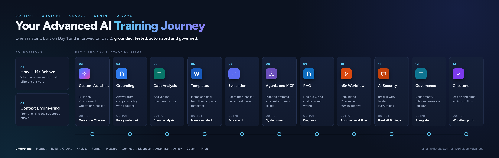

# AI for Workplace (Advanced)

A two-day hands-on course that takes participants from using AI assistants to building, grounding, testing and securing their own AI solutions.

You do not need a GitHub account to use anything on this page.

**Version 0.1**, last updated 8 October 2026.

---

## Program Flow

---

## How to Use This Site

Each module has a **Notes** page with the objectives, topics and lab, and a **Prompts** page with every prompt you type during the lab. The notes tell you which prompt to use and when.

To copy a prompt: open the module's prompts page, find the prompt, and click the copy icon in the top-right corner of the grey box. Then paste it into your AI tool.

To download everything: **[download all course files (ZIP)](https://github.com/Asraf-JS/AI-for-Workplace-Advanced/archive/refs/heads/main.zip)**. Save the ZIP, then right-click it and choose **Extract All** before you open any file.

To read offline or print: download the **[course book (PDF)](./AI-for-Workplace-Advanced-Book.pdf)**. It has every module's notes and prompts in one file.

---

## Course Scenario

This is the continuation of **AI for Workplace (Beginner)**. Participants build one assistant on Day 1 and keep improving it: grounding it in company policy, producing on-brand documents from templates, measuring its accuracy, and on Day 2 rebuilding it as an agent workflow with human approval.

---

## Works with your AI subscription

Every lab is written as a tool-neutral task, with product notes for:

| Tool | Tiers covered |
|---|---|
| Microsoft 365 Copilot | Copilot Chat (Basic) and M365 Copilot (Premium) |
| ChatGPT | Free and paid plans |
| Claude | Free and paid plans |
| Gemini | Free and Google Workspace |

Labs that need extra tools use free options: Gemini Notebook, formerly NotebookLM (Google account), and n8n (trial account). The [product cards](./14-product-cards/) explain how to do each lab in your tool.

---

## Modules

| Day | # | Module | Prompts | Lab | Time |
|---|---|---|---|---|---|
| 1 | 01 | [How Large Language Models Really Behave](./01-how-llms-behave/) | [Prompts](./01-how-llms-behave/prompts.md) | Compare a quotation analysis on two model types | 40 min |
| 1 | 02 | [Context Engineering and Structured Output](./02-context-engineering/) | [Prompts](./02-context-engineering/prompts.md) | Three-step prompt chain with Markdown output | 50 min |
| 1 | 03 | [Building Custom AI Assistants](./03-custom-assistants/) | [Prompts](./03-custom-assistants/prompts.md) | Procurement Quotation Checker | 70 min |
| 1 | 04 | [Grounded Research and Source-Based Answers](./04-grounded-research/) | [Prompts](./04-grounded-research/prompts.md) | Policy knowledge notebook with citation checks | 55 min |
| 1 | 05 | [Advanced Data Analysis with AI](./05-data-analysis/) | [Prompts](./05-data-analysis/prompts.md) | Purchase history analysis | 55 min |
| 1 | 06 | [Controlling Output with Word and PowerPoint Templates](./06-output-templates/) | [Prompts](./06-output-templates/prompts.md) | Approval memo and deck from company templates | 60 min |
| 1 | 07 | [Evaluating AI Output](./07-evaluating-output/) | [Prompts](./07-evaluating-output/prompts.md) | Score the Quotation Checker on ten test cases | 45 min |
| 2 | 08 | [AI Agents, Connectors and MCP](./08-agents-connectors-mcp/) | [Prompts](./08-agents-connectors-mcp/prompts.md) | Map the systems an assistant needs to act | TBA |
| 2 | 09 | [Retrieval-Augmented Generation (RAG) Fundamentals](./09-rag-fundamentals/) | [Prompts](./09-rag-fundamentals/prompts.md) | Diagnose a wrong citation | TBA |
| 2 | 10 | [Building an AI Agent Workflow in n8n](./10-n8n-agent-workflow/) | [Prompts](./10-n8n-agent-workflow/prompts.md) | Quotation approval workflow with human approval | TBA |
| 2 | 11 | [AI Security for Practitioners](./11-ai-security/) | [Prompts](./11-ai-security/prompts.md) | Break-it round: hidden instructions | TBA |
| 2 | 12 | [AI Governance in the Malaysian Context](./12-ai-governance/) | [Prompts](./12-ai-governance/prompts.md) | Department AI rules and use-case register | TBA |
| 2 | 13 | [Capstone Project](./13-capstone/) | [Prompts](./13-capstone/prompts.md) | Design and pitch an AI workflow | TBA |
| Ref | 14 | [Product Cards](./14-product-cards/) |  | How to do the common steps in Copilot, ChatGPT, Claude and Gemini | Self-paced |

---

## Sample Data

All lab data in this repository is fictional. Each module that needs files has a `sample-files.zip` in its folder, made from synthetic data for the fictional company Sinar Maju Sdn Bhd. Module 06's [sample files](./06-output-templates/sample-files/) hold the Word and PowerPoint templates.

Please do not upload real company, customer or personal data into any AI tool during class unless your organisation has approved that tool for it.

---

## Before You Start

You will need a laptop with desktop Word and PowerPoint, access to at least one of the AI tools above, and a Google account for Gemini Notebook (formerly NotebookLM). Your trainer will share n8n access details before Day 2.

---

## Need Help?

During the course, ask your trainer. After the course, contact the training coordinator who arranged your class.

---

*Last updated: October 2026 | Trainer: Asraf, Microsoft Certified Trainer (MCT) and HRD Corp certified trainer*

© 2026 Asraf. All rights reserved.
